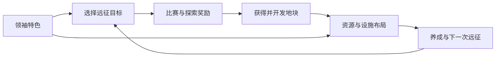

# 黄狗风云：参考《文明 VI》的战略经营扩展提案

> 2026-09-06 更新：本文件中的“固定球探中心直接发掘／最多五座中心”已被 [可移动球探首版](SCOUT_UNITS_2026-09-06.md) 覆盖。现在每玩家最多一座中心，可位于任意己方地块；LV1 最多两名球探，从招募中心出发，在移动后的当前地块发掘。升级数量及其他路线效果仍属于后续规划。

日期：2026-09-06  
状态：供用户审阅；仅规划，未改玩法、数值或存档，未打包。

用户新增方向：每名玩家的领袖技能、中立地块随机特殊奖励、地块资源。本文的具体技能、资源种类、相邻规则、数量和开放批次均为建议，尚未确认。与 [ROADMAP_2026-09-06.md](ROADMAP_2026-09-06.md) 配套阅读。

**本轮细化（同日，待审阅）**：用户进一步要求多路线通过建筑协同产生不同收益。具体改造见 [DEVELOPMENT_PATHS_2026-09-06.md](DEVELOPMENT_PATHS_2026-09-06.md)：青训、竞技科研、商业、球迷文化、远征五条可混合路线，先由设施组合和项目形成区别，再由领袖强化偏好。发展路线、专业分支、相邻协作及实施批次以该新提案为最新建议；仍未实施。

## 一、希望形成的体验

玩家能回答三个问题：“我的俱乐部擅长什么？”“下一块地为什么值得去？”“这片领地怎样建设更合适？”

建议把领袖、探索、资源和设施连成一条发展路线：

例如：青训型玩家优先找人才地块，在附近安排球探与训练；商业型玩家优先发展商圈和港口；探索型玩家投入地图发现和地区委托。球队仍通过已有足球比赛决定挑战结果，经营层为组队和比赛提供长期目标。

## 二、从《文明 VI》借用哪些设计

| 参考机制 | 黄狗风云的对应建议 |
| --- | --- |
| 领袖能力改变发展取向 | 每个玩家选择一种俱乐部经营风格 |
| 地块资源与开发 | 占领后的收入、材料和服务条件 |
| 区域选址与相邻收益 | 同一座设施放在不同位置，收益不同 |
| 部落村庄的探索奖励 | 中立征服后的特殊事件与选择奖励 |
| 城邦任务 | 地区足协、独立青训学院等 NPC 委托 |
| 政策槽 | 后期可调整的俱乐部经营方针 |
| 不同发展目标 | 地域征服、青训、建设、探索等成就路线 |

《文明 VI》官方手册介绍了资源开发、区域选址、政策槽及城邦任务；部落村庄奖励首个到访者。这里参考它们产生选择的方式，具体足球玩法为本项目提案。[官方手册：资源 48–50 页、区域 98 页、政策 122 页](https://downloads.2kgames.com/civilization/vi/manuals/eu/CIV_VI_25TH_ONLINE_MANUAL_ENG.pdf)、[官方手册：部落村庄 90 页、城邦 127 页](https://downloads.2kgames.com/civilization/vi/manuals/eu/CIV_VI_25TH_ONLINE_MANUAL_AUS.pdf)。

官方玛雅说明中，领袖能力与城市距首都的距离有关，特色区域也利用周边地块获得收益。这启发本项目让领袖能力与发展位置相互配合，而不是只给所有操作加同一个系数。[玛雅与大哥伦比亚官方更新说明](https://support.civilization.com/hc/en-us/articles/37662909263507-Civilization-VI-Maya-Gran-Colombia-Pack-Update)。

需要适配的差别：黄狗风云是持续运行的多人服务器，玩家可在不同时间加入；冷却和产出采用服务器时间。当前地图是实际地区板块，设施槽位为主场 3、普通地块 1，保留这些条件。首版利用经营与远征效果，不引入士气、宜居度或一整套新的比赛属性。

## 三、领袖技能：让每个账号有发展特色

### 建议结构

- 领袖属于玩家账号，代表俱乐部的经营者；与球员卡、队长和球员特性分别展示。
- 首版每个领袖配一个被动能力、一个主动技能；每名玩家生效一个领袖。
- 相同领袖允许多人选择，选择不由先到先得决定。
- 新玩家在建队流程末尾选择；老玩家在新增功能后获得一次选择，不重新选 33 人。
- 首版确认后锁定选择。若后续开放更换，技能冷却、已领取权益和进行中任务继承，不能切换刷新奖励。
- 先以经营、信息和行动效率形成特色。以后若加入直接影响比赛的领袖，另行定义快照、作用对象和引擎验证。

以下名称为工作名，数值和冷却待经济表测算。

| 领袖风格 | 被动能力建议 | 主动技能建议 | 地图与建设倾向 |
| --- | --- | --- | --- |
| 青训教父 | 指定一座球探中心作为青训基地，匹配人才资源时获得额外的地区筛选能力 | 发掘新星：下一次合格球探任务多一个候选，仍只领取一张 | 人才资源、球探与训练 |
| 基建能手 | 指定一处重点建设区，降低该地设施升级的部分建材成本 | 集中施工：加速一项已付费工程，仍需完成正常建设条件 | 建材产地、设施升级 |
| 远征开拓者 | 个人探索事件出现时多一个选择，仍只领取一项 | 区域勘察：揭示当前位置附近有限范围的地块资源和中立守军概况 | 未探索地区、事件与路线选择 |
| 商业经营者 | 指定一座核心商店，从周边不同种类已开发资源获得有上限的经营加成 | 招商合作：为该店启动一项有完成条件的限时经营合同 | 商圈、港口与资源多样性 |
| 航路专家 | 指定一座己方港口为母港，改善从这里出发的新航程 | 航路规划：为下一次合法航行提供一次耗时优惠 | 沿海地块和跨区域发展 |
| 康复专家 | 指定一座医疗中心为专科中心，提升该中心的治疗服务 | 专家会诊：缩短一张伤员卡的剩余治疗时间，有缩短上限 | 医疗中心、恢复中心与医疗资源 |

“指定一座”让能力服务于布局，并限制简单增加领地数量带来的无限叠加。指定地点不能每次操作随意切换，迁移条件和冷却与领袖规则一起确定。

前两类依赖球探/建设实际业务；商业、航路和康复依赖对应基础规则。首轮建议选青训、建设、探索三个风格验证，再加入其余风格。候选加一会提高选择价值，即使卡片评级概率不变，也需要纳入收益测算。

### UI

地图现有玩家信息区域放领袖头像，角标仅显示可用或冷却。点击展开：领袖名称、被动实际效果、一个主动按钮。需要指定地块/任务/球员时，再进入目标选择。

主动技能显示目标、费用、预计结果；被动详情显示“作用于哪座设施”。不在顶栏新增一排长说明，也不把完整技能文案堆在地图上。

## 四、中立地块的随机特殊奖励

### 分开处理三种收益

| 收益 | 触发与作用 | 是否随着地块换主重复发放 |
| --- | --- | --- |
| 既有征服奖励 | 延续当前挑战结算，作为测算基线 | 按现行规则；不在本提案中擅改 |
| 个人探索事件 | 玩家首次完成符合条件的中立征服，有机会触发选择奖励 | 同账号同地块不因放弃或再占领重置 |
| 稀有世界地标 | 全服共享的有限发现目标，提供纪念、称号或有限经营奖励 | 首发现权益不重置；持续服务依归属规则处理 |

不要把所有收益都设置成全服一次。建议普通事件以个人完成记录为主，世界首发现只占少量，并避免给首发现者永久独占关键养成能力。

个人首占仍可能受剩余中立地块数量限制。因此长期版本另提供个人地区探索委托，目标可以是访问已发现的合法地点或挑战固定 NPC，不要求夺走其他玩家领土。独立 NPC 据点也为晚加入者保留常驻玩法；这属于后续地图内容规划，不修改当前地块归属。

### 事件候选

| 事件 | 可以给玩家的选择 |
| --- | --- |
| 当地青训营 | 接受一次当地国家/俱乐部池试训，或领取训练服务权益 |
| 赞助商来访 | 领取一笔金币，或接受收益更高但需要完成目标的经营合同 |
| 旧物资仓库 | 获取建材，或选择一项短期建设优惠 |
| 医疗援助 | 对合格伤员使用一次有限治疗援助，或领取以后可用的绑定治疗权益 |
| 足球档案 | 获得地区图鉴、后续挑战线索；机制审核后再加入特性相关目标 |
| 地区名宿挑战 | 开启一次额外 NPC 挑战机会，完成后取得受预算限制的地区奖励 |

建议采用“抽到事件，再选择回报”：随机决定遇到什么，玩家决定怎样利用它。常规事件可给两个相近价值的选项，探索型领袖增加第三个。奖励稀有度、事件触发率和卡片评级概率分开配置和显示。

地区球员奖励复用现有可用球员池，产出 +0、无训练成长。不存在合格候选时使用明确的合法兜底选项；不要按地区名称凭空生成球员或重新引入未批准特性。

### 体验与边界

- 主要事件适合当下进度，但保留惊喜；不会因为没有伤员、设施满级而只得到无法使用的回报。
- 稀有事件可设计保底，保底增加的真实平均奖励必须计入经济测算；首版不先定未经验证的概率。
- 事件候选由服务端一次生成并保存，取消窗口、刷新和断线返回同一组选择。
- 奖励只领取一次；展示日志保留上限与去重凭据分别设计，不能删掉旧记录后又可重复领。
- 常规奖励不设置短时间强制领取倒计时；允许稍后决定。周期活动有明确结束时间和未领取处理规则。
- 主体奖励来自正常玩法；限额与掉落池应抑制反复占领、账号互相交地等重复收益。
- 世界竞争奖励与个人事件分别标识，避免两名玩家都以为自己拥有同一份首发现奖励。

### UI

进入可见范围后，稀有事件地块显示一个简洁符号；普通随机事件在获胜结算时揭示。弹窗只显示事件名称、奖励图标/数量和选项按钮。领取后显示结果，待处理事件可从既有通知入口再次打开。

## 五、地块资源：占领之后还有建设理由

### 首版资源表示

建议首版使用“金币 + 一种统一建材库存”；人才、商圈、补给、医疗和港湾等作为地块资源标签。后期确认存在足够的独立用途后，再考虑把药品或补给做成单独库存。

每块地首版最多一个主要资源，允许没有特殊资源的普通地块。资源分布属于游戏配置，不把示例当成真实地区的资源结论。

| 资源 | 自身作用 | 与现有设施的配合 |
| --- | --- | --- |
| 建材产地 | 开发后缓慢产出统一建材，用于设施升级和资源开发 | 为建设路线提供持续供给 |
| 商圈 | 开发后提供小额金币基础收入 | 俱乐部商店提高经营产出 |
| 青训人才 | 提供一个地区球员发掘条件 | 球探中心获得有限定向选择；训练中心可发展针对性项目 |
| 医疗资源 | 提供当地治疗服务条件 | 医疗中心降低部分费用或改善一类治疗任务 |
| 补给资源 | 提供当地恢复服务条件 | 体能恢复中心支持附近驻扎的远征队 |
| 天然良港 | 地理服务条件，仅在适合的沿海板块出现 | 港口改善从本港出发的航程 |

资源开发是地块自身的一项状态，建议消耗金币、材料和服务器时间，不额外增加第八种通用建筑，也不消耗现有设施槽。首版只开放一个开发等级，设施仍按普通地块 1 槽/主场 3 槽建设。

基础设施可以在合法地块正常工作；资源提供额外优势。日常训练、自然恢复及基础医疗不以占到某种稀有资源为前提。缺少建材时可通过正常远征获取，后续考虑有定价约束的 NPC 补充渠道。

### 同地块与相邻效果

建议先采用简单规则：

- 同地块匹配资源的收益最明显。
- 相邻只认地图上真实接壤的地块；海路连通不等同于接壤。
- 首版资源配合仅使用己方已开发、未停用地块，其他玩家和中立地块不提供相邻经营收益。
- 同类相邻来源只取有限个，资源效果不逐层传递。
- 建造确认前显示该位置的预计收益，包括来自哪块地。
- 失去来源地后停止后续加成；已经合法完成的训练和已获得球员不会被倒扣属性。
- 暂时不引入跨大陆全领地叠加。

举例：球探中心放在人才地块，获得最强的地区发掘支持；放在邻近人才地块的普通地块，可以获得较小支持，把人才地块的唯一设施槽留给训练中心。商业玩家可能为同一片区域选择商店与港口。

数值展示示例（不是已定价格）：某商店基础 100 金币/小时，同地资源 +20，相邻来源 +10，最终显示 130/小时。实际模型采用加算还是乘算、上限多少，进入经济表统一确认；UI 展示最终值，详情列来源。

### 世界与经济边界

- 地块资源在世界初始化或一次明确迁移时分配并持久化，不随进入地图或重启重新随机。现有世界不能无说明重新分配或清档。
- 新玩家可达范围应存在基础发展资源或替代来源；沿海、内陆和跨海起点分别检查可达性。
- 对同类全局服务设递减/生效范围；资源和设施收益有建设成本，避免领地数量直接无上限倍增所有收益。
- 已入个人库存的资源随玩家保留；换主只改变后续产出与当地服务。首版不附带掠夺对方整个库存。
- 资源点的开发状态、设施及进行中任务在占领时如何继承，应与玩家领地规则一起确认。
- 资源首次开放时先不附加玩家资源交易；目前玩家直接金币交易仍为后台代办。
- 建造、升级、拆除、回收、交易和奖励要一起测算。材料 NPC 兑换价不能与事件或退款形成循环获利。
- 持续收益按服务器时间结算，离线与在线保持同一规则；离线收益上限如需设置须明确展示，不与在线累计偷偷采用不同价值。
- 初始 100 万金币及现有回收、挂牌最低价、汰换规则均未因本提案修改。

### UI 与地图性能

正常地图只显示资源小图标；“资源”图层可突出类型和可见地块。远景聚合/隐藏小图标，近景再显示，沿用当前加载与渲染优化方向。

地块面板显示：资源名称、开发状态、实际产出、开发按钮。建造/升级时显示具体收益变化；无需在每一块地的面板反复说明资源规则。

## 六、可继续扩展的四个方向

### 1. 俱乐部发展项目

把科技/市政式进展缩为少量俱乐部项目：青训网络、专业医疗、远征后勤、商业经营。

通过实际行为推进，例如完成一组球探任务解锁地区青训项目。首版使用任务进度和金币/材料，不再增加科研点、文化点等多个数值。目标可以多条并行，但成长权益有明确解锁条件；平衡后再决定是否互斥。

### 2. 经营方针

后期提供少量可调整槽位，例如“青训优先”“商业合作”“远征保障”。切换影响后续任务，有明确生效时间，不能在扣费与领奖之间反复切换获利。

领袖提供长期特色，经营方针允许阶段调整。UI 与球员特性分开，避免玩家误以为方针可以装备到卡片。

### 3. NPC 合作与地区地标

地区足协、独立学院和赛事组织者提供个人任务；完成后获得有限服务或地区项目进度。合作关系首版可允许多个玩家独立发展，不急于加入独占宗主机制。

足球地标可以解锁纪念收藏、当地赛事或特色服务；核心医疗、球探或正常卡片养成不能只能从全服唯一地标获得。地标的球员奖励要与现有卡池和经济统一评审。

### 4. 多种长期目标

设置征服、青训、建设、探索等并列成就，让少占地、重经营的玩家也有目标。前期用于个人里程碑和展示荣誉；是否采用赛季结算、全服胜负或清档仍单独决定。

## 七、一个完整玩法示例

一名玩家选择青训教父。他查看周边已揭示资源，决定先挑战有人才资源的中立地块。

获胜后正常获得已有征服奖励，又遇到青训营事件。他在金币与地区试训之间选择后者，得到一次受规则限制的选卡机会。

占领后，他投入建设资金开发资源，并在人才地块建训练中心，在相邻己方地块布置球探中心。唯一设施槽使这次布局有取舍；人才资源对相邻球探的加成小于同地块加成，交换来的是训练项目。

随后他需要建材升级设施，因此下一次远征目标转向建材地块。期间领袖主动技能为一次球探任务提供额外候选，但仍只领取一人。球员继续进入现有训练、强化、编队、挂牌或汰换流程。

商业型玩家在同一张地图上可能优先攻商圈，投入商店与港口，再通过现有市场购买球员。资源使两种路线都有地图目标，领袖放大各自特点。

## 八、调整后的实施顺序

线上稳定性和基础经济/状态规则仍是前提。新增三项应提前参与规则设计，分批实现，避免先完成全部设施后又改产出体系。

| 批次 | 建议范围 | 暂缓内容 |
| --- | --- | --- |
| A：先验证探索 | 个人中立事件、少量奖励类型、领取恢复与记录 | 世界唯一大奖、复杂连环事件 |
| B：资源与设施一起落地 | 建材/商圈/人才三类资源；资源开发；建设、球探/训练和商店实际效果；简单相邻预览 | 多种库存、复杂运输链 |
| C：开放领袖差异 | 青训、建设、探索三个风格；统一目标选择和服务端冷却 | 全部领袖、直接比赛属性加成 |
| D：接入恢复与远征 | 基础体力/伤病已完成后，医疗/补给/港湾资源与对应设施和领袖 | 全球无限服务叠加 |
| E：长期内容与竞争 | NPC 合作、地标、经营方针、区域项目；资源点争夺完善现有 PvP | 未确认的赛季清档和玩家直接交易 |

与主路线图对应：A 放入 M1；B/C 放入 M2；D 跨 M1/M2 依赖推进；M3 处理资源点占领变更；E 中长期目标归 M4。各批次是建议范围，不代表本次批准实施。

## 九、实施时必须核验的内容

- 奖励、领袖技能和资源开发重复请求只结算一次；同一地点多人操作不会重复发放独占权益。
- 保存技能冷却结束时间、事件待选择项、资源结算时刻，重启恢复一致。
- 展示记录有数量/时间上限，永久去重状态采用紧凑结构；周期活动结束后清理过期明细。
- 不为每个账号/地块建立每秒持久化任务；采用时间差结算和事件发生时处理，适应当前 2 核/2GB 测试机。
- 归属改变、升级、拆除、领导能力迁移时，先结算旧时段，再启用新规则。
- 任务开始时锁定费用及领袖/资源优惠；奖励候选首次生成后固定。丢地、换方针和更新不能重复套用优惠。
- 比较不同领袖、起始地理、在线频率的 7 天/30 天收益；评估资源产出对当前卡片市场的影响。
- 最小试验至少能展示两种合理布局和两种合理奖励选择；如果所有玩家都只选同一项，需要先调整再扩量。

本轮只保存方案与路线图，不创建新玩法数据，不更改卡池、真实存档、服务器或发行包。
