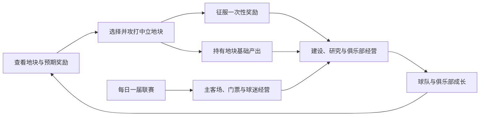

**科技研究逻辑纠正（2026-09-08，覆盖旧科技树布局）**：四方向入口：阵型、战术、强化、生物。先选对象，再展示该对象独立等级链；阵型／战术 Lv1–5 累计 +1% 至 +5%；强化按主卡＋材料组合，Lv1–10 每级 +0.5 个百分点、累计最多 +5 个百分点；生物仅占位。仍为 UI，未开启研究结算／真实加成。23 项回归、37 项隔离浏览器检查通过。见 [RESEARCH_SUBJECT_LEVELS_2026-09-08.md](RESEARCH_SUBJECT_LEVELS_2026-09-08.md)。Ctrl+F5。

**最新奇观运行时（2026-09-08，优先于下方“仅草稿／未接入”记录）**：24 座奇观已开放生产力建造；后台建设条件即时用于新开工，已有项目锁定原条件；效果按本轮批准快照运行，后续改效果文本仍需修改后端。现有系统加成已接入，5 座依赖未开放系统的奇观按用户确认可建造、待系统开放生效。839 次完整检查、25 项最终回归及 18 项隔离浏览器检查通过。见 [WONDERS_RUNTIME_2026-09-08.md](WONDERS_RUNTIME_2026-09-08.md)。**需自行重启游戏服务后 Ctrl+F5。**

# 黄狗风云：地块、资源与研究设定 · 2026-09-07 · v6

**奇观草稿与后台条件（2026-09-08，最新）**：用户已授权补拟空白效果和全部建设条件，并要求后台可编辑。已保留 5 段后台原文、拟定 19 座效果和全部 24 座条件；后台支持生产力、相邻设施、地形组合与球员人数/国籍/俱乐部/位置。旧存档优先，参考草稿手动保存后持久化，清空不回填。826 次完整检查、32 项隔离浏览器检查通过。仅设计管理，未启用奇观效果。见 [ADMIN_WONDER_CONDITIONS_2026-09-08.md](ADMIN_WONDER_CONDITIONS_2026-09-08.md)。**需自行重启服务后 Ctrl+F5。**

**远征外观更新：** 五款球星原型单位已制作并接入可保存的选择入口；这是外观选择，不附加球队或行军能力。见 [球星远征单位](EXPEDITION_UNITS_2026-09-07.md)。

**模型资产更新（v2）：** 七类设施 LV1～LV5、战棋与球探共 37 模型已完成辨识度重设计，从低级就有独立布局与配色，并同步游戏图像。见 [设施辨识度重设计](FACILITY_REDESIGN_2026-09-07.md)。这是美术进度，升级、建设消耗与研究的玩法状态仍按下文规定。

本版依据用户最新阐述重写。它取代旧资源／土地方案及旧路线图中的经营设定；开发排期见 [路线图 v6](ROADMAP_2026-09-07.md)。用户随后授权全图产出与图标实施，并确认金币、生产力、科技值三种基础产出。资源含义以 [资源产能与建设](RESOURCE_CAPACITY_2026-09-07.md) 为准，设施方式和费用以 [双建造方式](BUILDING_METHODS_2026-09-08.md) 为准：金币累计，生产力／科技值不累积；生产力平均分配到全部在建设施。赞助合同已接入中立征服追加奖励，详见 [赞助商接入](SPONSORSHIP_2026-09-08.md)；研究、其余新奖励和奇观效果尚未实现。旧三资源专项仅作历史记录。

文中区分三种状态：**已确认方向**来自用户明确描述；**实施建议**用于安排落地，不冒充用户已定规则；**待定规则**必须在对应功能实际接入前明确。用户已授权平衡单／多产与产量，首轮配置已经实施；设施双建造方式与首批需求已实施；合同奖励的 35% 概率及三档 70／20／10 权重已作为首轮配置实施；其余征服规则、研究曲线和门票公式仍待明确。

## 1. 游戏的发展循环

玩家在欧洲和南美地图上经营足球俱乐部。选地既要考虑能否攻下、能挖到什么球员，也要考虑占领后的基础产出与征服时的预期奖励。资源进一步用于建筑、研究和俱乐部经营，研究成果再影响球队比赛表现及球员强化。

基础产出与征服奖励是两套收益。一个地块可以倾向产出生产力，同时提供球迷或合同奖励；不能把“产金币地”理解成只能奖励金币。

## 2. 地块的三个独立维度

| 维度 | 已确认方向 | 影响范围 |
| --- | --- | --- |
| 国家类别 | 保留核心国家／非核心国家 | 原有中立地块难度、球探发掘池 |
| 地形与基础产出 | 森林、山脉、丘陵偏生产力；沿海、平原偏金币 | 金币、生产力、科技值三种持有收益 |
| 中立征服奖励 | 六类随机奖励，攻打前可查看预期 | 此次征服提供的额外收益 |

所有权、主场身份、现有设施继续作为独立状态。核心／非核心不自动成为资源品质等级，也不因新增经济分类重新定义球探池。

**已实施：** 地形采用可组合的标签。例如“森林＋丘陵”“沿海＋平原”，不用把所有地块硬塞进互斥的五个桶。实际产出由统一配置决定，显示与结算使用同一份结果。

| 定性示例 | 国家类别 | 基础产出倾向 | 可配置的征服奖励示例 |
| --- | --- | --- | --- |
| 森林丘陵地 | 核心 | 生产力 | 球迷 |
| 沿海平原地 | 非核心 | 金币 | 一次性生产力 |
| 内陆平原地 | 核心 | 金币 | 赞助商合同 |
| 山地 | 非核心 | 生产力 | 珍奇卡包 |

上表仅说明三个维度可以组合，不指定任何真实地块的最终奖励、概率或品质。奖励不按国家类别、地形示例自动绑定。

稀缺性的首轮表达来自基础产出差异、地形组合与奖励价值分布。是否需要额外品质档位、独占资源或邻接加成仍待决定，不延续旧方案的六类禀赋和固定品质配额。

## 3. 资源与经营词条

| 词条 | 本版含义 | 已明确的来源／去向 | 尚未确定 |
| --- | --- | --- | --- |
| 金币 | 现有通用资金 | 地块基础产出、征服奖励；后续主场门票与赞助收益 | 征服奖励额及后续经营费用；基础产量已实现 |
| 生产力 | 不累积的当前建设能力，决定设施建设速度 | 持有地块贡献合计；所有在建项目平均分配，完工即重新分配 | 建设长期数值平衡；一次性奖励的边界与指定地块 |
| 科技值 | 不累积的当前研究能力，决定科技研究速度 | 持有地块贡献合计；阵型、战术、强化研究待接入 | 研究工作量、并行分配、等级与加成；旧研究点奖励如何表达 |
| 球迷 | 玩家俱乐部的球迷数量 | 中立征服奖励；用于后续俱乐部发展和主场经营 | 初始量、日常增减、票房关系、是否按地区细分 |
| 赞助商／合同 | 有品牌、条件和权益的合同记录 | 中立征服可获得随机合同；参考 S4 系统适配 | 获取后是否需签约、期限、名额、权益和收益 |

金币是可支出的存量；生产力和科技值是当前能力，空闲不积累，离线也不进入余额。项目已经完成的建设／研究进度可以保存，这与囤积资源不同。球迷是数量，赞助商落为具体合同。顶部保留统一资源栏，逐项悬浮列出当前来源；不再展示五词条弹窗和说明小字，未接入机制状态以设定与路线记录为准。

本版不把建材、运营物资、专业知识、地区影响力加入首批资源。旧方案中这些字段、消耗链、经营席位和默认容量不再作为当前开发前提。

## 4. 地块基础产出与生产力

### 已确认方向

- 每个地块有可辨认的基础产出类型，首批为金币、生产力、科技值；金币累计为余额，另外两项增加当前能力。
- 森林、山脉、丘陵倾向生产力；沿海、平原倾向金币。当前有 632 个单产、720 个双产、118 个三产地块；科技有专精与混合分布。
- 生产力决定现有设施建设速度，所有在建项目平均分配；新增／完工／拆除改变项目数量后重分配。零生产力时暂停并保留进度。
- 只有部分地块给予一次性生产力奖励，获得后必须立即指派到具体建设项目，不进入储备。
- 现有核心／非核心分类继续用于原来的难度和球探用途。

### 实施建议

地块用资源图标和数值显示三项产出，不显示“/小时”；顶部金币悬浮可查看每小时来源，生产力／科技值悬浮可查看当前贡献。现有手动设施提供金币瞬建与生产力建造两个独立选项。每点生产力每分钟完成一点需求；港口 500、产能 50 独建时需要 10 分钟。并行项目平均分配，完工即重新分配。新建列表移除预计时间小字，已开工项目保留进度和倒计时。

一次性生产力的“获得后立即指派”已经确认。正式奖励流程应展示可选项目和预期推进量，完成指定与结算；不能改成可长期存放的待分配额度。无可选项目、超出剩余工作量等边界仍待决定，当前尚未开放这类奖励。

地形数据必须能稳定复现。现有森林和山地视觉可作为核对对象，但不能用当前镜头里随机生成的树木数量、缩放级别或客户端渲染结果决定实际收益。游戏地形、地图表现、后台配置与服务端产出需要一致。

### 规则状态

- D01（已实施）：现有地图固定地貌／森林场分类、可组合标签；小地块回退与全图记录见三资源专项。
- D02（已实施）：1,470 块单／双／三产配置不变。金币 / 小时；生产力、科技值为能力贡献。预算权重 12 金币／1 生产力／1 科技值只用于分布平衡，不是兑换比例或工程费用。
- D03（已确认并实施）：当前总生产力由所有在建项目平均分配，完工后即时重分配；不累积，不手动囤存或转移额度。
- D04（双建造方式已实施）：金币支付原价 5,000 后立即建成；生产力方式不扣金币，需求为港口 500、球探／训练 400、医疗 350、恢复 300、商店 250，每点产能每分钟推进一点需求。除港口示例外均为可调整的首批实施值。旧项目保留需求与进度。自动主场与升级未开放规则不变。
- D05（部分确认）：一次性生产力只来自部分地块、取得后立即指派已确认。具体奖励地块、数量、无项目、已完工、溢出、取消、失去目标地块的处理仍待定。
- D06（已实施）：金币离线结算；施工按当时拥有的产能和项目推进。空闲不会获得生产力／科技值余额；换主按前后所有权分段处理。旧累计余额转入历史审计记录，不自动兑换成新奖励。

本版不默认“获得一次性生产力就砍掉该地森林”，也不新增伐木指令。用户使用砍树类比的是即时推进建设的效果；是否改变地貌需要另行决定。

## 5. 中立地块：预期奖励与征服结算

### 六类奖励

| 奖励类型 | 玩家最终应收到的内容 | 必须有的接收与查看入口 |
| --- | --- | --- |
| 珍奇卡包 | 对应现有珍奇球员卡包 | 背包及原有开包流程 |
| 随机赞助商合同 | 一份具体的合同／待处理合同 | 赞助商合同列表和详情 |
| 球迷 | 一定数量的俱乐部球迷 | 俱乐部球迷数量及本次增量 |
| 金币 | 一定数量的金币 | 现有金币余额与变动记录 |
| 一次性生产力 | 可推进建筑项目的工程投入 | 项目选择／分配及进度结果 |
| 科技相关奖励（形式待重新确认） | 旧“可用研究点余额”与新规则冲突，不能照旧发放 | 待明确具体奖励形式；不得自动引入科技值库存 |

保留原六类奖励方向；其中科技相关奖励的具体形式需按“不累积”新规则重新确认，不把原点数余额作为有效规则。“珍奇卡包”与现有其他档次卡包区分，不能随意替换成“随机任意卡包”。每个地块抽一种还是可同时有多种，仍待确定。

### 攻打前能看懂，胜利后能核对

地块悬浮信息与点击详情至少分开表达：国家类别／挑战难度、地形、基础产出、预期征服奖励。移动端以点击承接。新经济信息不会替代原球探相关信息。

预期奖励应让玩家了解将争取哪一类收益。若数量或合同身份要到胜利后抽取，界面应如实显示范围或随机条件；不能把范围写成保证值，也不能在预览中承诺一种奖励、结算时改发另一类。

**实施建议：** 采用服务端保存的奖励配置或实例，预览与结算共用版本，避免刷新悬浮窗反复抽取。抽取在世界生成、首次揭示、挑战开始还是胜利结算时发生，需要先确定；“预期可见”不自动等于每份合同的品牌与金额都已完全公开。

### 接入前待定

- D07：每地块奖励类别数量、各类权重、数量或价值区间、地区与难度是否参与配置。
- D08：随机结果确定时点、预览展示到什么粒度，以及与迷雾可见性的关系。进入攻打决策时必须可查看产出与预期奖励。
- D09：奖励资格按世界首次、玩家首次还是其他口径；何时算成功征服，丢失后再夺回或恢复中立是否再发。
- D10：新的六类奖励替换还是叠加原金币／卡包奖励；旧挑战进行中时用哪版规则。

结算必须把征服状态、奖励归属、发放记录关联起来。同一成功事件因重试、重启或重复领取不能再发一份；这项工程约束不替代 D09 对合法再次奖励机会的产品定义。

## 6. 科技研究

### 研究归属于玩家

玩家选择研究对象，当前科技值决定研究推进速度，达到一定研究水平后获得对应加成。研究对象保存进度／等级；科技值自身没有可消费余额。空闲科技值不累积。并行研究是否开放、如何分配仍未确认，不能把建设的平均分配自动套到研究。

| 方向 | 研究对象 | 已确认的生效含义 | 待定的效果表达 |
| --- | --- | --- | --- |
| 阵型研究 | 某一个具体阵型 | 玩家使用该阵型时获得加成，研究水平提高可增强效果 | 加哪些参数，作用球队还是特定位置，是否分段解锁 |
| 战术研究 | 某一种具体战术，例如摆大巴 | 研究投入提升该战术对应加成 | 强化哪些战术参数，与原克制和阵型效果如何叠加 |
| 强化研究 | 各强化等级对应的成功率 | 研究提高对应强化成功率 | 分等级研究还是共用课题、提升方式及上限 |

研究不能只在界面显示等级。阵型和战术的收益必须接入实际比赛计算；强化研究的收益必须接入真正的强化判定，界面概率与实际使用概率一致。

**实施建议：** 阵型、战术使用现有系统的稳定标识，避免“摆大巴”和另一套名称成为两个研究对象。比赛加成优先在比赛上下文中计算，不把研究效果永久写回球员卡基础能力，以免切换阵型后残留。最终作用参数仍由 D12 决定。

### 三类研究的查看方式

- 阵型：当前研究水平、已投入进度、当前加成、下一阶段目标；选用阵型时能知道研究是否生效。
- 战术：战术名称、研究进度和已获得效果；实际使用该战术时能核对应用情况。
- 强化：明确区分“球员当前强化等级”和“本次目标强化等级”，显示基础成功率、研究贡献及最终成功率。

### 接入前待定

- D11：研究对象列表、各阶段工作量、等级或阈值、并行课题与科技能力分配、重置／切换时进度处理、前置或互斥。按速度推进已确认，不再等待“花余额立即升级”的选项。
- D12：阵型与战术的具体加成参数、触发和叠加方式、生效赛事范围；比赛中切换阵型／战术如何处理。
- D13：强化研究按哪个等级归类，加算百分点还是乘算、研究收益上限、与保护规则和现有收费的关系。
- D14（部分完成）：地块提供当前科技值能力与展示已实现，旧余额已退出。研究推进及科技相关征服奖励形式、成长节奏、联赛／世界周期关系待定。

所有最终概率都必须处在合法范围内，但本版不预设“每级加若干百分点”或固定科研等级上限。科技值决定研究速度已确认；研究队列、并行策略与科技建筑仍不是默认前置。

## 7. 球迷、赞助商与每日联赛

### 已确认方向

- 球迷是俱乐部发展要素，中立征服奖励可直接增加球迷数量。
- 后续玩家联赛每天完成一届，类似用户描述的 S4 每日赛事。
- 主场位置用于设计主客场，主场比赛有门票收益，球迷与主场经营有关。
- S4 的赞助商系统用于参考适配；随机合同纳入中立地块奖励。

### 已实施的球迷人口（2026-09-08）

初始 5,000；每满一小时 +100，离线增长；旧档保留已有球迷且仅补发一次初始量。每块自有地需要 1,000 球迷提供完整三资源，缺额按比例折算。默认按 `金币 / 12 + 生产力 + 科技值` 择优分配，可切金币／生产力／科技值优先。分配不消耗球迷，各地同时按人数比例贡献三资源；闲置球迷仍属于总量。右上面板显示分配、偏好与利用率。金币和实际建造按历史增长分段结算，赞助收入不受影响。详见 [球迷人口机制](FANS_POPULATION_2026-09-08.md)。门票等待 M5，不把示例票价、上座率作为既定规则。

### 已实施的赞助合同（2026-09-08）

18 品牌，普通／球场冠名／球队冠名分别 1／2／2 天、每小时 200／300／600 金币，名额 3／1／1。合同仅由中立地块成功征服获得，先待签约，接受后起算；不发签约奖金，满一小时后首次付款，离线补发封顶至到期。待签约不计时，满额与品牌冲突保留合同；同品牌不同时生效。冠名保留原名称，到期恢复。

首轮征服追加概率 35%，命中后普通／球场／球队权重 70／20／10，18 品牌等权；保留原金币和珍奇包。该概率和权重为本轮实施配置，可继续平衡。普通赞助显示在电视台当前主场球场外侧，宽屏竖排、窄屏横排，最多三份并等比例适配。

管理、图鉴、金币来源、主客场切换、保存回滚和小时结算已完成。详见 [赞助商接入](SPONSORSHIP_2026-09-08.md)。球迷和每日联赛另行实施。

### 接入前待定

- D15（已实施）：初始 5,000，每小时 +100；每地块需求 1,000；自动综合收益／金币／生产力／科技值偏好；部分利用按比例折算，分配不消耗球迷。征服奖励可增加人数；当前不分地区、不加入流失。
- D16（已实施）：待签约、期限、名额、同品牌互斥、到期、满额保留、每小时付款已落地。当前无额外比赛履约条件；以后联赛相关权益需单独明确。
- D17：日赛报名、分组规模、主客场赛制、开赛时间、阵容和研究锁定时点、离线参赛及取消重赛规则。
- D18：球迷如何影响观众需求，球场容量、票价、票房归属与结算；哪些赛事有效。

球迷以本次确认的 5,000 初始、100 /小时和 1,000 /地块实施；不沿用旧地区分布、门票价格或双循环人数样例。合同按已实施规则执行。

## 8. 奇观：单独等待用户接入指令

24 座彩色模型与后台奇观管理已经完成，欧洲 16、南美 8，包含伯纳乌球场。用户自行填写效果，允许空白暂存。

**明确约定：用户填完并通知开始接入后，才读取后台最新保存内容，批量接入游戏并验证；留空奇观继续保留草稿。** 本次重写路线不构成这条接入指令，不读取或导出用户正在编辑的实际草稿。

接入时，先整理每座已填写奇观依赖的资源、建筑、研究、联赛或赞助能力，再安排批量实现。效果文字有明确含义的按用户内容处理，尚不明确的规则集中核对，不用旧效果 JSON 代填，也不把自由文本直接执行。

用户此前提出的建造条件、大量投入、长期收益、可能被其他玩家抢先，可保留为奇观系统方向。唯一性范围、竞建过程、退款、换主、工期、费用和每座效果仍需明确，不能沿用旧方案参数。

## 9. 新版对旧方案的处理

| 旧方案内容 | 本版处理 |
| --- | --- |
| 建材、运营物资、专业知识等资源链 | 退出当前首批范围；使用生产力、科技值、球迷、合同的明确含义 |
| 六类土地禀赋、品质配额、经营席位、仓储、邻接体系 | 不作为当前地块经济前置；保留在历史档案 |
| 社区活动、科研课题样例、固定日赛／票房公式 | 不继承为规则，相关扩展需后续明确 |
| 旧 R0～R7 路线与 24 座助手效果 | 不作为实施依据；新版 M 阶段取代排期建议，奇观效果以用户后台填写为准 |
| 30× 地图、24 座模型、奇观后台 | 保留已实现成果 |
| 足球征服、球探、训练、强化、球员市场、背包 | 继续沿用，通过明确接口增加新收益与研究效果 |

不改变已确认的球探数量／跨海规则、中心升级占位、初始选人约束，也不恢复已回退的体力、伤病或士气大方案。

## 10. 接入完成应能回答的问题

玩家攻打前能知道：这块地难在哪里、球探池受什么影响、基础产出是什么、赢了预期得到什么。

征服后能知道：奖励实际到账到哪里、生产力如何投入项目、科技值如何投入研究、合同如何处理、球迷增加了多少。

使用成长成果时能知道：哪项研究在当前阵型／战术／强化中生效，以及最终结果如何计算。技术验收应覆盖旧档兼容、重试不重复、失败保留、离线／重启一致和必要的数值边界；具体玩法参数以 D01～D18 的最终决定为准。
