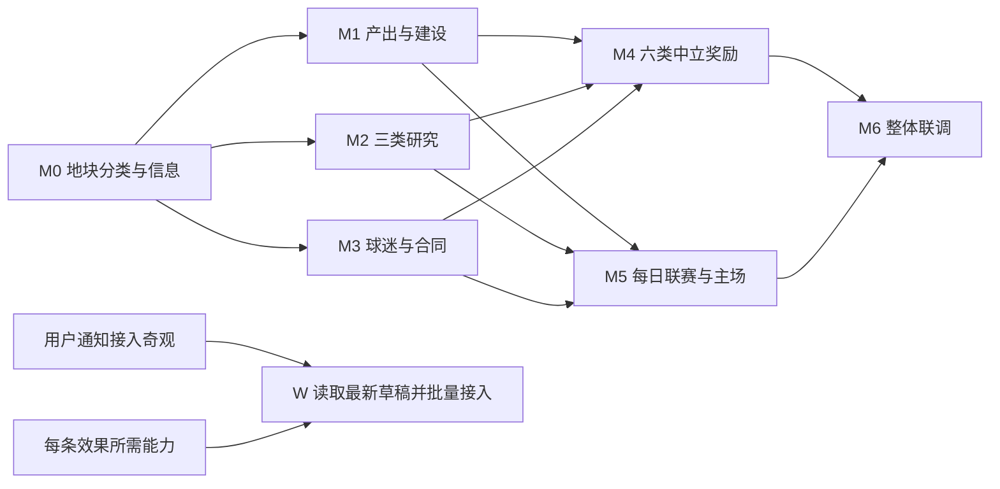

**科技研究逻辑纠正（2026-09-08，覆盖旧科技树布局）**：四方向入口：阵型、战术、强化、生物。先选对象，再展示该对象独立等级链；阵型／战术 Lv1–5 累计 +1% 至 +5%；强化按主卡＋材料组合，Lv1–10 每级 +0.5 个百分点、累计最多 +5 个百分点；生物仅占位。仍为 UI，未开启研究结算／真实加成。23 项回归、37 项隔离浏览器检查通过。见 [RESEARCH_SUBJECT_LEVELS_2026-09-08.md](RESEARCH_SUBJECT_LEVELS_2026-09-08.md)。Ctrl+F5。

**最新奇观运行时（2026-09-08，优先于下方“仅草稿／未接入”记录）**：24 座奇观已开放生产力建造；后台建设条件即时用于新开工，已有项目锁定原条件；效果按本轮批准快照运行，后续改效果文本仍需修改后端。现有系统加成已接入，5 座依赖未开放系统的奇观按用户确认可建造、待系统开放生效。839 次完整检查、25 项最终回归及 18 项隔离浏览器检查通过。见 [WONDERS_RUNTIME_2026-09-08.md](WONDERS_RUNTIME_2026-09-08.md)。**需自行重启游戏服务后 Ctrl+F5。**

# 黄狗风云开发路线图 · 2026-09-07 · v6

**奇观草稿与后台条件（2026-09-08，最新）**：用户已授权补拟空白效果和全部建设条件，并要求后台可编辑。已保留 5 段后台原文、拟定 19 座效果和全部 24 座条件；后台支持生产力、相邻设施、地形组合与球员人数/国籍/俱乐部/位置。旧存档优先，参考草稿手动保存后持久化，清空不回填。826 次完整检查、32 项隔离浏览器检查通过。仅设计管理，未启用奇观效果。见 [ADMIN_WONDER_CONDITIONS_2026-09-08.md](ADMIN_WONDER_CONDITIONS_2026-09-08.md)。**需自行重启服务后 Ctrl+F5。**

**远征外观更新：** 五款球星原型单位已制作并接入可保存的选择入口；这是外观选择，不附加球队或行军能力。见 [球星远征单位](EXPEDITION_UNITS_2026-09-07.md)。

**模型资产更新（v2）：** 七类设施 LV1～LV5、战棋与球探共 37 模型已完成辨识度重设计，从低级就有独立布局与配色，并同步游戏图像。见 [设施辨识度重设计](FACILITY_REDESIGN_2026-09-07.md)。这是美术进度，升级、建设消耗与研究的玩法状态仍按下文规定。

本版按用户最新思路重写，设定依据为 [GAME_DESIGN_2026-09-07.md](GAME_DESIGN_2026-09-07.md)。旧 R0～R7 路线已归档，当前采用下列 M 阶段。

用户已确认的是机制方向；阶段顺序是据此提出的实施安排。用户后续已授权全图资源和图标实施。当前已完成 M0 分类／基础产出展示及 M1 金币累计、两项能力显示、生产力平均分配建设，并接入六类设施的金币瞬建／生产力建造。M3 赞助合同及 M4 合同追加奖励已完成，研究与其余新奖励尚未实施；一次性生产力须立即指派已确认，奖励流程待定。详见 [资源产能与建设](RESOURCE_CAPACITY_2026-09-07.md) 和 [设施双建造方式](BUILDING_METHODS_2026-09-08.md)。没有读取或接入用户奇观效果。未定参数在相关阶段开工前逐项明确，不要求现在一次决定全部规则。

## 1. 当前起点

| 已有能力 | 新版处理 |
| --- | --- |
| 核心／非核心分类、中立挑战、球探发掘池 | 保留现有职责；增加独立地形与经济维度 |
| 欧洲／南美大地图、地貌表现、30× 缩放 | 复用地图；补稳定的游戏地形分类和产出信息 |
| 金币、卡包及原中立奖励 | 复用钱包、背包、挑战成功入口；新旧奖励关系另行明确 |
| 设施建造、训练、强化、阵型与战术 | 作为生产力和三类研究的实际接入目标；不因新计划开放原升级占位 |
| 金币／生产力／科技值基础产出 | 全图 1,470 块分类与展示；金币累计，生产力／科技值为不累积的当前能力 |
| 球迷、赞助商、每日玩家联赛 | 赞助 18 品牌、合同管理、冠名与小时收益已实现；球迷奖励及日赛未实现 |
| 24 座奇观彩色模型、后台自由文本管理 | 已完成；用户填好并通知后，再按最新草稿批量接入 |
| 最近验证 | 791 次完整检查、25 项赞助专项及 43 项赞助浏览器检查通过 |

## 2. 开发顺序与依赖

先让玩家看懂地块价值，再完成新收益的使用入口，随后整合六类奖励，最后串联日赛经营。奇观是一条由用户明确通知触发的接入工作，不用旧效果方案预先占据主线。

| 阶段 | 交付结果 | 前置 | 接入前要明确的规则 |
| --- | --- | --- | --- |
| M0 地块分类与信息预览 | 地形、基础产出和预期奖励有独立数据与展示；原难度／球探信息保留 | 当前地图与挑战系统 | D01、D02、D07、D08 中涉及分类和展示的部分 |
| M1 基础产出与生产力建设 | 金币、生产力、科技值基础产出可结算，生产力能推进已确定的建筑，一次性生产力有使用路径 | M0 | D02～D06 |
| M2 科技值与三类研究 | 阵型、战术、强化三方向能投入、持久化并真实生效 | 现有比赛／强化系统；M0 的资源词条约定 | D11～D14 |
| M3 球迷与赞助合同基础 | 球迷能到账查看，合同能接收、查看与按已定规则管理 | 现有账号／经济系统；M0 的奖励类型约定 | D15、D16 |
| M4 六类中立奖励完整接入 | 攻打前看预期，征服后六类奖励均可准确发放、查看和使用 | M0、M1、M2、M3 | D07～D10、D05、D16 的奖励边界 |
| M5 每日联赛与主场经营 | 每天完成一届玩家联赛，主客场、门票、球迷和有效赞助串联 | M1 的经济结算、M2 的比赛加成、M3 的经营数据 | D15～D18 |
| M6 整体联调与平衡验收 | 地图、建设、研究、经营形成一致的完整循环 | M4、M5 | 前述已定规则及验收后发现的平衡调整 |
| W 用户奇观效果批量接入 | 所有已填写条目按用户效果接入；空白保留草稿 | 用户明确通知＋每条效果的实际依赖 | 用户草稿中的效果含义与奇观公共规则 |

D 编号对应 [设定 v6](GAME_DESIGN_2026-09-07.md) 的待定条目。它们是规则记录，不是要求现在逐条答复的问题清单。

M1、M2、M3 在概念与接口对齐后可以分别开发；默认单线按表顺序推进。M5 无须等待 M4 完成：如果最终合同必须依赖正式联赛履约，应先完成 M5 的相关能力，再开放那类合同奖励，不能为维持排期假定合同无条件付款。

六类奖励正式开放前，相应接收和使用能力必须就绪。开发期间可用隔离数据演示，不将尚未能兑现的奖励包装成已上线功能。日赛不是阵型／战术研究的天然前提：先在哪些现有比赛中生效，由 D12 明确。

## 3. M0：先让地块价值可辨认

**状态：部分完成。** 全图稳定分类、单／双／三产、悬浮／点击和四个新图标已实现；六类预期奖励仍待 D07／D08。

**玩家结果：** 悬浮或点击地块，可以区分原挑战难度、球探相关信息、基础产出和征服预期。

工作内容：

- 从现有地图数据与表现中梳理森林、山脉、丘陵、平原、沿海；建立明确的游戏分类依据。
- 核心／非核心、地形、基础产出、奖励配置分开维护，避免改动一个字段同时改变守军、球探和经济。
- 根据确认后的规则产出可核对的全图分类报告，检查欧洲／南美、内陆／沿海、地形组合与现有主场样本。
- 改地块悬浮与详情，移动端使用点击入口；基础产出与一次性奖励分区显示。
- 预览和后续结算采用统一来源。尚无正式数值的配置留待确定；不把临时值写成正式承诺。

验收：原难度和球探池未因经济分类改变；刷新、缩放不改变地形和产出类型；同一地块在悬浮、详情与服务端记录中一致；六类奖励均有明确展示语义。

本阶段不必先建仓储、经营席位、区域协作、邻接系统，也不需要开放奖励发放。

## 4. M1：三资源产出与生产力建设形成可用循环

**状态：部分完成。** 金币累计、当前两项能力、合并资源栏、生产力平均建设、完工后重分配、离线与旧档兼容已实现；一次性奖励与立即指派流程尚未实现。

**玩家结果：** 占领后的基础产出有实际价值，生产力能用到具体建筑上。

工作内容：

- 已完成：按 D02／D06 结算金币；生产力／科技值显示当前能力，空闲不累积。
- 已完成：按 D03 平均分配当前总生产力；新增、完工、拆除后重分配，零产能暂停，离线按工作进度推进。
- 已完成：六类设施独立选择金币瞬建或生产力建造；需求为港口 500、球探／训练 400、医疗 350、恢复 300、商店 250，每点产能每分钟完成一点需求。列表去掉预计时间小字，施工项目保留进度和倒计时；旧项目不重新定价。
- 完成一次性生产力的接收、项目选择和推进，覆盖没有可用项目、溢出、取消与目标归属变化。
- 为在建项目、旧领地和已付金币制定兼容处理，再用隔离旧档验证；不直接改用户实际存档。

验收：金币结算与产能推进区分清楚；所有项目分得的生产力之和不超过当前总能力；失败不会扣款丢进度；离线、换主和重启按已定规则结算，不重复发建筑完成奖励。升级占位仍按当前用户约定保留。

## 5. M2：完整实现三类科技研究

**状态：研究未开始。** 当前科技值能力及地块来源已就绪，不等于阵型／战术／强化加成已经生效。

**玩家结果：** 科技值能用于阵型、战术、强化研究，研究确实改变对应使用场景。

工作内容：

- 按 D11 实现当前科技值驱动研究速度，研究对象保存进度；明确工作量、课题并行与分配。科技值不进入余额，不默认增加科研建筑或队列。
- 整理现有阵型、战术稳定标识与强化等级语义，完成研究列表、详情、投入和收益展示。
- 阵型研究接实际比赛上下文，使用对应阵型时应用已确定的加成。
- 战术研究接实际战术参数，例如使用摆大巴时应用该项已研究收益；保留原战术系统的其余规则。
- 强化研究接真实成功率判定，展示基础、研究贡献和最终概率；与现有保护／价格的关系按 D13 处理。
- 按 D12 确认生效赛事、阵型战术切换和比赛期间新研究的生效边界，保存可解释的使用版本。

验收：研究速度和已完成进度保存一致，空闲科技值不累计；三方向都可用；不使用某阵型／战术时没有残留对应加成；界面概率与真实判定一致；固定输入下能核对实际参数变化，重启不丢研究，也不因反复打开界面重复生效。

内部验收可通过隔离夹具配置当前科技能力，不以尚未完成的中立奖励入口阻塞科研实现。正式投放节奏在 M4／M6 核对。

## 6. M3：先让球迷和合同奖励有接收入口

**状态：部分完成。** 赞助合同获取、待签约、签约／到期、18 品牌图鉴、按小时发金币、冠名与电视台主场广告已实现，见 [赞助商接入](SPONSORSHIP_2026-09-08.md)。球迷初始 5,000、每小时 +100、每块地需求 1,000、自动偏好分配与实际收益／建设联动均已完成，见 [球迷人口机制](FANS_POPULATION_2026-09-08.md)。M3 的球迷与合同接收、展示、持久化入口已完成；门票仍在 M5。

**玩家结果：** 看得到自己的球迷数量，获得合同时有地方查看和处理。

工作内容：

- 依 D15 增加球迷记录与俱乐部展示；未决定地区分布时，不先做全国地理明细或隐含流失公式。
- 只读复核 S4 赞助源码与素材，列出可复用的品牌、合同、签约／到期、冠名和展示组件。
- 将合同接入本项目账号与经营记录，按 D16 区分奖励获得、待处理、生效及到期等最终需要的状态。
- 处理同品牌、名额满、过期和重复奖励事件；结果必须可追踪，不能悄悄丢失合同。
- 已确认且不依赖日赛的合同权益可在此阶段实现；日赛相关履约明确连接 M5，不预付未经决定的收益。

验收：球迷、合同都能经统一奖励入口接收并持久化；用户能看到来源与内容；保存失败可安全重试；合同不能凭刷新或重启重复发钱。禁止迁入 S4 的真实账号、余额或正在生效的玩家合同。

## 7. M4：开放完整六类征服奖励

**状态：部分完成。** 合同以 35% 概率在原金币／珍奇包之外追加，攻前预览概率、胜利结果与待签约管理已接通；其他新奖励与六类完整整合待定。

**玩家结果：** 在选择攻打目标时知道预期收益，胜利后收到可核对、可使用的奖励。

工作内容：

- 将已明确的金币、珍奇卡包、球迷、合同、立即指派的一次性生产力接到征服成功事件。科技相关奖励先确认新形式，不能继续发科技值余额。
- 确定奖励生成时点、预览粒度、类别数量与抽取规则；预览和发放引用相同的有效配置／结果。
- 明确与原金币和卡包奖励的替换或叠加关系，避免迁移时无意双发。
- 按 D09 实现奖励资格及再次夺取情形；一次成功事件的重复请求不重复发放。
- 将发放结果连接背包、合同、球迷、建筑项目和研究界面，统一显示“预期”和“实际到账”的区别。
- 核对并发挑战、取消、败北、保存失败、换主、旧挑战恢复，以及涉及两个玩家的实际归属。

验收：六类全部有预览、真实接收、持久化和后续入口；奖励与预览一致；未成功征服不按成功结果发奖；重试和重启不重复。规则允许再次奖励的情形应有新的合法事件记录，不能靠永久屏蔽所有复占回避设计问题。

到本阶段，地块差异、建设、研究与探索奖励已形成一轮可玩的成长循环。

## 8. M5：每日联赛、主客场和经营收益

**玩家结果：** 每天完成一届玩家联赛，主场位置、球迷和合同开始在赛事经营中发挥作用。

工作内容：

- 按 D17 实现日赛报名／分组、赛程、主客场、比赛推进、结果与下一届；使用当前比赛引擎和已定科研加成。
- 从俱乐部主场地块取得赛事所需位置，不预设要求远征单位移动去客场或开放额外编队。
- 按 D18 实现球迷、容量、票价和观众的实际关系，再进行门票结算；不沿用旧方案的示例公式。
- 接入已明确的球迷增长和合同履约，区分每场比赛结算、整届联赛结算和合同期限推进。
- 完成离线、重启、取消／重赛、阵容变更与研究变更的边界处理，复用战报和赛事展示。

验收：一天一届的完整流程可恢复；主客场安排符合已定赛制；没有重复赛程或重复票房／赞助款；赛事使用的研究与阵容版本可解释。日赛是否影响其他长期进度必须有明确规则，不能让通用重置逻辑意外清掉领地或研究。

## 9. M6：整体联调与平衡

围绕玩家决策验证：金币地、生产力地和科技地是否各有用途，六类奖励是否有选择价值，科技投入能否形成可辨认的研究路线，球迷与赞助能否服务俱乐部发展。

检查对象包括新玩家与已有账号、不同扩张速度、核心／非核心、欧洲／南美、各类地形、不同研究投入和联赛参与情况。模型周期与样本规模根据最终规则选取，不把旧方案的收益预算带入新版。

验收重点是收益来源与用途相匹配、研究叠加可解释、强化概率在合法范围、先发优势和资源可达性可评估，以及失败／重启后资产与进度保持一致。发现数值失衡时回到对应规则调整，不默认用新增仓储、经营席位或体力系统补洞。

本阶段形成可审阅的本地验收结果。打包、发布和部署只在用户另有明确要求时执行。

## 10. W：用户奇观效果的批量接入

**触发条件：用户明确说已填好，并通知开始接入。** 普通后台保存和本次路线重写都不会触发。

收到指令后：

1. 读取后台最新已保存条目，保留版本，整理已填写与空白清单。
2. 把每条效果对应到所需资源、研究、建筑、联赛和赞助能力；集中列出语义不明或尚无承接规则的部分。
3. 按用户效果和已明确的奇观公共规则完成批量接入，提供游戏内展示与生效解释。
4. 验证生效范围、重复结算、停用／换主等实际涉及的情形，以及各奇观之间的叠加。
5. 全部已填写条目逐项报告完成或具体缺口；空白继续草稿，不能拿旧助手效果补齐，也不能只做几个样例就声明整批完成。

W 不固定等到 M6 后才开始；它按用户指令及每条效果的真实依赖安排。若效果依赖尚未完成的机制，应明确标记该依赖，不静默简化或替换用户效果。

## 11. 下一步与文档维护

已完成合并资源栏、金币存量／两项当前能力、图标重绘、平均生产力建设及设施双建造方式；本轮完成 18 品牌赞助合同、中立合同奖励和电视台主场广告。后续按用户指令明确 D05 的一次性奖励边界和 D11～D14 的研究工作量与收益；不自动启动未定机制。M0 已追加合同概率预览；其余新奖励预览与 M1 一次性奖励仍未完成。

新版机器可读阶段表见 [roadmap.json](../outputs/roadmap-20260907/roadmap.json)。旧路线及旧资源设定见 [归档说明](archive/planning-v1-20260907/README.md)。
