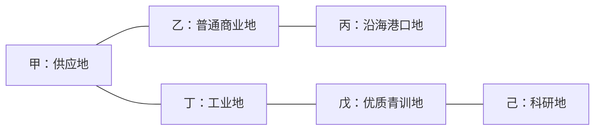

# 黄狗风云：多资源与地块差异化规划

> 最新边界：本文件仅保留讨论背景。机制未定，不得据此自动实施或预填奇观效果；当前采用由用户在后台自由填写效果、允许空白暂存的工作方式。

日期：2026-09-07（09-06 开始整理）  
状态：产品规划 v2，已纳入球迷、每日完整联赛、奇观与 S4 赞助方向；未实施玩法或修改真实数据。参数仍为候选。

## 1. 建议结论

建议把地图经营发展成三个相互关联的系统：**资源决定要做什么，地块决定在哪里做更合适，设施组合决定如何做。**

在金币之外增加建材、运营物资两种消耗库存，并把有地理分布的球迷作为核心长期资产。球迷与每天完成一届的联赛、门票和赞助一起前置；专业知识保留为后续进度，原地区影响力点合并进球迷体系。世界奇观成为需要选址与竞建的长期工程，唯一性不随日赛季重置。详见[球迷、奇观与赞助整合规划](FANS_WONDERS_SPONSORS_PLAN_2026-09-07.md)。

最终希望出现这样的决策：我现在有钱，但缺少训练项目用的物资；南边的供应地能解决眼前需求，北边的青训地能改善招募选择，西边的普通地块则能连接两座设施。哪一块值得下一次远征，要看我的阵容与发展计划。

推荐先实现能完整运行的“占领—开发—生产—消耗—再选目标”循环。资源首发必须同时包含消耗项目、单地起步保障和离线结算，不能只给地图贴图标、给顶栏加数字。

### 与此前提案的关系

- 旧提案建议“金币 + 一种建材”。本次针对多资源地图的要求，将运营物资加入首期，并提供不依赖体力、伤病的新用途。
- 延续五条可混合发展路线的方向，但先通过土地和项目产生差异；领袖不是首期依赖。
- “核心／非核心国家”继续服务于现有球探国家池，停止承担土地经济价值的分类职责。分类标签可以留在服务端，地块主界面改以实际产出和特色为主。
- 当前每玩家一座球探中心、两名球探，从中心出发并可跨海移动的规则保留。
- 当前普通地块一建筑槽、主场三槽的空间限制保留。资源开发独立于建筑槽；现有建筑升级仍为占位，本规划不会据旧价格数组自动开放升级。
- 设施／经济／体力／伤病的大方案仍是已回退状态。本次不恢复该方案，也不加入士气。

## 2. 《文明 VI》中值得借用的逻辑

| 参考机制 | 给玩家带来的选择 | 本项目的对应设计 |
| --- | --- | --- |
| 加成、战略、奢侈三类资源承担不同职责 | 有的改善产出，有的满足消耗，有的提供稀缺服务 | 分开设计地块产能、可消耗库存、地方特色；不把每种地貌都变成新货币 |
| 开发资源后才能利用 | 占地之后还有投入与建设 | 拥有地块只取得开发权；需开发并安排经营席位才能持续产出 |
| 战略资源积累与消耗 | 可以为接下来的行动储备 | 建材、物资按服务器时间产出，进入有容量的账号库存 |
| 区域选址和相邻加成 | 一块普通地也可能是关键位置 | 同地匹配、直接邻接、有限设施支援组合 |
| 同一种奢侈品的重复来源不重复提供同类宜居度收益 | 追求种类和交换，而非无脑堆同一种 | 地方特色按种类与具体服务生效；重复特色不无限增加全队能力 |

原版手册区分加成、战略、奢侈资源，说明资源开发和重复奢侈品的不同作用。这启发本案区分“库存”和“土地特色”；本案不移植宜居度或幸福系统。[《文明 VI》官方手册，资源章节](https://downloads.2kgames.com/civilization/vi/manuals/eu/CIV_VI_25TH_ONLINE_MANUAL_ENG.pdf)

“每回合累积战略资源库存，再用于单位、建筑或项目”的参考明确来自《风云变幻》，不是把原版资源规则混为一谈。本案将回合结算改为持续运行服务器的时间结算。[《风云变幻》官方手册，第 12 页](https://cdn.2kgames.com/manuals/civilization-vi/gathering_storm/2KGMKT_CIV6_Gathering_Storm_PC_Online_Manual_V7_US.pdf)

玛雅天文台从农场、种植园获得不同相邻收益，是“同一设施因周边不同而改变价值”的具体参考。本案的足球设施效果、数值和地图分配均为原创建议。[玛雅与大哥伦比亚官方更新说明](https://support.civilization.com/hc/en-us/articles/37662909263507-Civilization-VI-Maya-Gran-Colombia-Pack-Update)

黄狗风云的关键差异是：真实行政区域大小不一、持续运行、多人异步加入、足球比赛决定攻防。因此不能直接照搬六角格每格产粮、城市人口劳动分配和先占唯一资源就永久锁死他人的规则。

## 3. 资源体系：三种库存、球迷资产与研究进度

| 项目 | 性质与来源 | 消耗或作用 | 无此资源时 | 开放安排 |
| --- | --- | --- | --- | --- |
| 金币 | 通用货币；现有比赛、回收、交易，加上主场门票和赞助 | 现有费用、开发与大型工程 | 沿用现有规则 | 已存在，收入渠道分批接入 |
| 建材 | 消耗库存；工业地、通用开发、委托与部分赞助 | 开发、器材、球场扩建、奇观工程 | 主场生产与限量采购兜底 | 多资源基础 |
| 运营物资，简称“物资” | 消耗库存；供应地、通用开发与部分合同 | 调研、训练、社区活动及工程 | 原有普通球探、训练、比赛和己方移动照常可用 | 与实际用途同批 |
| 球迷 | 按来源地分布的俱乐部长期资产；建队、每日联赛、探索、活动 | 观赛需求、赞助档位、发展资格和地区市场；不直接扣人数作为费用 | 一次起步群体，普通活动也可发展 | 与每日联赛／主场经营一起前置 |
| 专业知识 | 不可交易的研究进度；科研地与训练课题 | 解锁精细培养和经营选择 | 普通训练设施较慢推进基础课题 | 后续研究批次 |

球迷替代前案单独累积的“地区影响力点”。地区合作保留任务与等级记录，不再新增一个重叠钱包。金币不能无限买断材料节奏，也不能直接把球迷买成可出售库存。

### 首期不拆木材、石料、钢铁、粮食和药品

木材、石料、工业设备可作为不同资源产地的表现，都产出建材；农贸、渔业和装备产业可产出物资，并提供不同特色服务。药品、燃料等待相关伤病／运输系统有明确独立用途后再评估。

### 球迷与研究的结算口径

- 球迷属于俱乐部，并保留来源地。丢地不把已有球迷转给胜者；迁移主场也不把全国球迷变成本地观众。
- 联赛按每天一届的预算结算球迷增长，中立事件固定领取，社区活动完成后产生当地球迷；文化地不再每小时生产抽象影响力。
- 球迷可满足发展门槛，但建设和签约不扣球迷人数；票房要经过观赛需求、容量和官方场次计算。
- 知识投入选定课题，完成成果永久保留；换课题不退款复制，未选课题只保留有限缓冲。
- 这两类成长不直接增加球员总能力、S 卡概率或比赛胜率。需要比赛效果时另行接入引擎验证。

每日联赛、票房、球迷分布、S4 赞助复用和奇观规则以[整合规划](FANS_WONDERS_SPONSORS_PLAN_2026-09-07.md)为最新建议。

奇观首批名单按用户最新要求为欧洲 16 座、南美洲 8 座，欧洲包含伯纳乌球场。本轮仅规划名单与美术资源，详见[24 座奇观美术规划](WORLD_WONDERS_CANDIDATES_2026-09-07.md)；新名单的具体效果现已形成 [24 座奇观效果草案](WONDER_EFFECTS_2026-09-07.md)，待评估，未实施。

## 4. 一块地由哪些因素组成

每块地保留归属、国家、守军难度、建筑和通路，增加四组经济信息。

| 层次 | 回答的问题 | 例子 |
| --- | --- | --- |
| 地理条件 | 什么布局在这里合理？ | 内陆／沿海、河流、山地、森林、交通连接 |
| 基础禀赋 | 最擅长产出什么？ | 工业、供应、商业、科研、青训、文化 |
| 地方特色 | 这里有什么别处不常见的服务？ | 装备产业、青训传统、天然良港、足球地标 |
| 经营选择 | 玩家把这块地用来做什么？ | 产建材、办活动、训练协作、招募支持 |

地块价值可以用“当前资源缺口 + 项目资格 + 邻接作用 + 扩张位置 − 开发成本与攻防风险”来评估。界面不把这些压成一个通用战力数值，也不把守军一至五星当成经济品质。

### 六种基础禀赋

以下是完整内容版的分布目标。基础资源依旧分批开放；文化地在球迷活动接入后提供当地球迷增长，科研地在研究接入前可用通用开发。未实现的特色不会伪装成已生效功能。

| 禀赋 | 适配产出／玩法 | 合适的设施与项目 | 约占地图 | 1,470 地块的示例配额 |
| --- | --- | --- | ---: | ---: |
| 供应地区 | 物资；农业、渔业、装备供应等表现 | 恢复设施未来用途，现阶段供应项目 | 30% | 441 |
| 工业地区 | 建材；施工与器材供给 | 开发工程、专项训练器材 | 24% | 353 |
| 商业地区 | 金币；稳定营业与合同 | 俱乐部商店、港口商业 | 20% | 294 |
| 科研地区 | 专业知识；精细培养 | 训练中心，未来医疗科研 | 10% | 147 |
| 青训地区 | 基础物资产出，以及本地招募条件 | 驻扎球探的位置调研、训练协作 | 10% | 147 |
| 文化地区 | 地区球迷与活动资格 | 球迷活动、主体育场／商店协作 | 6% | 88 |

这是建议配额，不是现有地图资源分布，也不是对真实国家产业和足球水平的判定。每块地首版一个主要禀赋，避免处处同时高产。

任何合法地块都可以选择低效率的通用建材、物资或商业开发；匹配禀赋时效率更高。普通地因此始终可用，稀有资源决定优势而非生存资格。

### 三种稀缺性需要同时存在

1. **产能稀缺**：高产地数量有限，但同类普通地能替代。
2. **服务稀缺**：某种特色提供更精细的调研、特定地区合作或特殊合同；基础招募和正常成长不被垄断。
3. **位置稀缺**：连接两类产地、服务多个相邻设施、接近合法远征起点。普通地也可能因位置成为关键目标。

建议经济品质分为普通、优质、稀有、地标，首轮内容配额可取 70%／24%／5%／1%，对应 1,029／353／73／15 块。此处地标是预置地图特色，不是玩家建造的世界奇观，后者另有唯一目录和选址条件。地标需要逐一设计，首轮试点不必一次做完 15 个。

- 普通资源无品质增幅；优质对匹配产出约 +10%；稀有约 +25%，并可能具备特殊服务。地标默认没有通用产能增幅，价值来自具体玩法。
- 品质只作用于该地匹配的经营产出，不能让一块稀有青训地同时成为最高产的矿场和商圈。
- 稀有服务不再叠一个未经测算的全局百分比。其资格本身已经是奖励，强度需要与产能一起核算。
- 不按照现实行政区面积发资源。一个面积很大的州仍是一个经营地块；一块小省也只有一个主要禀赋和一个经营单位。

## 5. 地方特色：让占地理由变得具体

下表给出可扩充的内容库，同一特色可以在多个地区出现。首期选前四类配套项目验证，其余依赖明确后再开放。

| 特色 | 适合出现的地点 | 特殊价值 | 约束 |
| --- | --- | --- | --- |
| 优质建材带 | 可解释的工业、石材或林业区域 | 更高的匹配建材产出 | 木材／石料仍合并为建材，不增加两种钱包 |
| 运动装备产业 | 工业与商业结合的地区 | 专项训练的物资折扣，候选上限 10% | 同一次项目折扣统一封顶 20%，不能与所有来源连乘 |
| 青训传统 | 配置的足球发展区域 | 普通青训服务偏向一条位置线；稀有服务可细化到某具体位置 | 仍三选一，不保证稀有球员，不增加球探数量 |
| 品牌商圈 | 商业禀赋地区 | 提供特定经营合同或改善一项合同条件 | 每账号合同额度不随商店数量叠加 |
| 体育科研集群 | 科研禀赋地区 | 特定课题的研究效率或课题入口 | 基础课题有通用设施渠道，不能永久锁死外地玩家 |
| 足球文化社区 | 文化禀赋地区 | 地区活动和合作进度 | 同类特色不反复叠全局被动 |
| 天然良港 | 使用实际海岸线校验的沿海地块 | 特色商业合同；后续加入合法航程服务 | 不限制当前球探和远征在己方领地间跨海移动 |
| 运动医学传统 | 对应设施已可用后配置 | 特定治疗服务或复训课题 | 等伤病规则形成后再设计资源消耗与效果 |
| 高原训练环境 | 高程条件明确的地块 | 受规则约束的身体属性组训练课题 | 不直接增加比赛体力，也不默认为现实科学结论 |
| 足球地标 | 手工配置、内容充分的少量地点 | 特殊 NPC 挑战、纪念展示、地区合作项目 | 基础养成不依赖地标；个人首次奖励不随换主重置 |

例如两块都叫青训地，也可以分别偏向后场调研和前场调研。差异由显式内容配置决定，不把某国籍球员绑定成天然强弱。

球探的服务条件以**球探当前驻扎地**为准。中心是招募和管理设施，不再被当成所有发掘任务的固定发生地。当前任务已经付费时使用任务保存的地点、费用和抽取规则快照。

## 6. 资源怎样出现在地图上

### 现有数据基础与缺口

本次只读核查 `assets/data/territory-index.json`：共 1,470 地块、64 个国家代码；83 地块有城市标记、38 地块有俱乐部标记、50 地块没有陆地邻居。现有地图提供 `landNeighbors`、`maritimeNeighbors`、坐标和城市／俱乐部关联；港口另有海岸线校验。

因此，城市、俱乐部标记只能作为参考锚点，不能直接转换为全地图人口或经济规模。现有森林、草甸等视觉分布中包含表现规则，也不能直接当成权威资源储量。

### 建议采用“地理约束 + 区域配额 + 固定种子 + 人工修正”

1. 离线提取可核验的沿海、河流、高程等信息。自然条件决定合法范围，不能在内陆随机生成天然良港。
2. 按连续陆地区域、岛群和玩法可达性划分合作区域，记录每区地块数与可用起点。跨海连边与陆地接壤分开处理。
3. 各区域分配六类禀赋和经济品质的预算，保证基础资源覆盖。地块多的国家按可玩面积／地块数上限分配，不按“核心国家”加权。
4. 在合法候选内用世界资源种子分配，整体轻度聚集、跨区互补；不能整片大陆只产一种资源。
5. 高价值组合采用独立配额，不同时把高产、稀有服务、优越邻接和低难度集中给同一小区。
6. 生成资源分布报告和地图预览，人工修正地标、极端邻接、孤岛和起点死角。固定结果持久化，刷新、重启、换主不重抽。

公平验收要求：每个新世界候选起点在可达的近邻范围应有基础资源或明确替代渠道；普通连通地区优先检查两次陆地扩张内能否接触建材、物资和一种特色。此指标不适用于无陆邻孤岛，孤岛使用主场生产、限额采购与合法海路单独验收。

资源数量配额须同时按地区人口无关的地块数归一化、以及实际可达距离检查，避免南美大州与欧洲小省的尺度差异造成规则偏差。真实世界资料不齐时使用明确标注的游戏经济配置，不能伪造产业事实。

### 难度、可见性与初始选址

- 经济品质与现有守军星级是两个轴。允许困难普通地，也允许容易但偏远的优质地；珍贵组合可以提高挑战难度预算，但本次不统一重算旧守军或征服奖励。
- 首选主场时显示基础禀赋和通用开发预览，便于主动选择。普通已知地貌不要求球探逐块付费扫描。
- 稀有特色在获得合法探索视野时揭示，之后记录为已知；再失去实时视野只保留上次所见状态。资源存在不等于知道敌方当前库存或经营状态。
- 机密特色、未揭示的种子和敌方运行信息不打进公开静态 JSON。初选全图可见的旧流程只展示允许公开的经济层，服务端按权限返回特色。
- 新世界可将稀有服务点和地标排除在免费主场候选之外，作为明确的新选址规则单独实现。当前世界不移动既有主场；迁移时不把独占地标放到现有永久主场之下。
- 不通过换主、重新选址、反复发现重新刷特色或首次奖励。

## 7. 开发与建设：一个地块一个经营选择

建议给地块增加独立的开发状态：**未开发 → 开发中 → 运行／停用**。它相当于土地改良，不是第八种建筑，也不占当前建筑槽。首期不做资源耗尽或随机产量衰减；稀缺性来自位置、开发投入和经营容量。

- 一个地块最多一个运行模式。可以开发其优势产出，也可以做较低效率的通用开发；不能同时拿满三种基础资源。
- 第一个主场免费开放通用开发，并发一次启动材料。以后开发消耗金币、建材和服务器时间。
- 地块开发与设施是两种选择：开发决定基础产出，建筑决定当地服务与匹配加成。一块工业地放训练中心，可以支撑训练器材；放商店则偏向经营。
- 第一批只做一级资源开发。建筑升级费用和工期不随这次资源引入自动变更。
- 更换运行模式有明确费用和停产时间；本次提出候选费用，不追溯扣除旧设施建造款。
- 普通球探、训练设施可继续使用；只有新增资源加成和经营项目参与新增经营容量规则。

### 经营容量限制

推荐账号初始 **3 个经营席位**，经通用俱乐部项目逐步扩展到 **6 个**。这表示当前能管理的资源经营地块数，不是一种新货币，也不是建筑数量上限。

每个运行地块占一个席位；同一地上的匹配设施加成不再占第二席。需要邻地支援时，支援来源也必须是己方已开发、正在运行的地块。超出经营容量的领地保留设施、驻军、通路与后续改造价值，但不产生新的被动经济收益。

新增地块商店收入、科研、社区活动和奇观服务都纳入该规则，避免停用产地却继续靠建筑免费生产。官方主场票房与基础赞助分别受赛程、场馆、球迷和广告位约束，不占土地经营席位。旧的普通训练、球探业务不受新席位拦截。

席位从 3 到 6 的扩展要求通用项目和实际经营目标，不绑定特定稀有地，也不依靠无限金币购买。切换运行地块先结算旧地，再停用并交接；候选交接时间 2 小时，账号同时一项，已有付费项目完成前不能借切换复制容量。

这一限制让占有 30 块地的玩家拥有更多选址与组合选择，但不会自动得到 3 块地玩家十倍的新增被动产出。后期是否继续扩大上限，应看实际经济数据。

## 8. 邻接与设施协作

首轮统一使用一个可解释的加算公式：

```text
每小时产出 = 当前运行模式基础产出 ×（1 + 匹配品质加成 + 同地设施加成 + 邻接加成）
```

候选同地匹配设施加成 +20%；每个合格、不同类别邻接来源 +10%，最多两个。普通／优质／稀有的品质加成为 0／10%／25%。因此首轮产出倍率最高 1.65；领袖尚未加入，未来加入时需共享总预算。

例如一块优质商业地，基础 120 金币／小时，同地有商店，邻接运行中的供应地和合法港口经营地，则为 `120 × (1 + 0.10 + 0.20 + 0.10 + 0.10) = 180`。这仍然是一块地的一条产出，不能把商店基础收入另算一次。

### 首轮兼容表

| 核心模式／项目 | 同地匹配设施 | 合格邻接来源，最多取两种 | 作用 |
| --- | --- | --- | --- |
| 建材生产 | 首期不强行指定现有建筑为采矿设施 | 运行中的供应来源、沿海港口经营来源 | 只提高建材产出 |
| 物资生产 | 首期没有通用的同地设施增幅 | 建材来源、运行中的商业来源 | 只提高物资产出 |
| 金币经营 | 俱乐部商店 | 供应来源、港口经营来源、文化来源，选两种 | 提高该地金币产出 |
| 科研，第二批 | 训练中心 | 青训来源，未来可用医疗设施来源 | 提高课题研究速度 |
| 地区球迷活动 | 商店的社区活动配置 | 青训来源、主体育场来源 | 改善本地区活动的球迷增长 |
| 球探／训练主动项目 | 实际发起项目的单位与设施 | 青训、装备产业等已批准来源 | 提供项目资格或有上限的物资优惠；不套用产出公式 |

规则边界：

- 邻接只用真实 `landNeighbors`；海路和跨海移动不自动构成相邻加成。
- 同地、相邻、品质来源逐条列出，不同界面不能重复计算一次加成。
- 一个支援来源同一时间最多服务一个核心，可保留自己的基础生产；核心最多两个支援，首版自动建议组合并允许调整。
- 某地执行要求暂停基础经营的独占项目时，不再作为别处的支援来源；开工与完工同时更新邻地产速。只影响新增经营协作，不中断旧的普通服务。
- 只读取来源是否合格，不读取其最终产出继续乘算，因此不会因 A 支援 B、B 支援 A 递归放大。
- 失去来源地、停产或拆除时，先结算到变更时刻，再更新后续产出。已完成成长不倒扣。
- 主动球探项目按球探当前地点查条件，不能因中心建在青训地便给全球球探加成。

### 普通地也能成为好地

假设一块普通商业地位于供应地与沿海港口经营地之间，建商店后每小时产出 `120 × 1.4 = 168` 金币。一块孤立的稀有商业地没有设施时为 `120 × 1.25 = 150`。前者可凭布局暂时超过后者；后者将来改善设施后又有更高潜力。比较时也要计入两处支援占用的经营席位。

这一示例的重点是让“品质、投入、位置”形成取舍，而不是强制每次选择稀有标签。

## 9. 新资源必须能花出去

以下参数用于第一轮原型测算。新项目是可选服务，不给现有所有操作追加资源税。

普通位置线调研和基础专项训练可通过已有球探、训练中心使用，不要求先占稀有地。青训特色、装备产业提供细化选择或有限优惠；这些优势不能反过来成为首个项目的必需条件。

| 操作 | 建议投入 | 时间／频次 | 结果与边界 |
| --- | --- | --- | --- |
| 开发一个新地块 | 1,500 金币 + 40 建材 | 1 小时 | 开放一个资源运行模式；仍需经营席位 |
| 改换开发模式 | 1,000 金币 + 20 建材 | 2 小时，期间停产 | 原状态不可一键反复切换获利；不退旧开发费 |
| 球探位置调研 | 原 500 金币 + 12 物资 | 原 10 分钟，占一名球探 | 在合法国家／评级池内优先展示所选位置线，仍三选一 |
| 专项训练 | 500 金币 + 10 建材 + 12 物资 | 原 10 分钟，占原训练席位 | 总成长仍为 5 点、属性仍封顶 99，改变允许属性组的分配倾向 |
| 商业活动 | 1,000 金币 + 20 物资 | 4 小时；每账号滚动 24 小时最多 2 次，同时 1 次 | 完成获得总计 2,600 金币，即净金币 +1,600；活动占用核心经营地、期间暂停其基础产出 |

位置调研先按原逻辑确定评级与国家分组，再在该合法分组内筛选位置；不足时回退同分组原池。不能先筛位置再提升高评级比例。候选需去重、固定保存；无足够适配候选时预览明确提示，必要时禁用该项目，普通发掘照常开放。

专项训练的可选属性组必须以现有 26 项属性配置形成白名单，并单独验证“同样五点但更集中”对战力与市场价格的影响。该项目不额外制造训练席位，也不允许并发训练同一卡。

这里的商业活动只是商店活动算例，不是 S4 式赞助合同。活动额度属于账号，开十家商店不能变成每天二十次。暂停生产的机会成本在确认页展示，已付费任务完成一次；资源不足时不自动扣金币代购。

### 持续消耗的结构

建材主要承担阶段建设和训练器材消耗，物资承担持续的招募／训练／活动消耗。中期建材可能相对过剩，这是应切换投资或发展其他项目的信号；不能用无内容的强制维修费消灭盈余。

发布前要观察 7／30 天中建材产地的利用率。若建设完成后所有玩家都永久弃用工业地，应先调低产出、提高有实际价值的器材项目需求，或在后续资源交易中接入需求，再增加新的产地。

## 10. 产量、仓储与首轮经济测算

### 候选起步参数

| 参数 | 第一轮候选值 | 目的 |
| --- | --- | --- |
| 任意地块通用开发 | 建材 1.5／小时、物资 4／小时、金币 80／小时，三选一 | 无特殊土地仍可发展 |
| 匹配禀赋的开发 | 建材 2／小时、物资 6／小时、金币 120／小时，按对应禀赋选择 | 根据资源用途分别定产速，形成选址效率差异 |
| 科研，后续批次 | 匹配地 3 点／小时；普通合格设施渠道 1 点／小时 | 文化地改为完成社区活动后增长当地球迷，不再每小时生产影响力 |
| 建材／物资仓储 | 各 240 单位，后续通用项目扩容 | 一块普通匹配产地空仓起，建材约 120 小时、物资约 40 小时满仓；多产地需更频繁消耗 |
| 一次性启动配给 | 60 建材 + 40 物资 | 足够开启一个后续地块并体验项目 |
| 兜底采购 | 建材 90 金币／个、物资 80 金币／个；各最多 30／滚动 24 小时 | 让缺资源玩家可行动，不让 100 万金币买断资源节奏 |
| 个人基础委托 | 完成一项真实操作后，12 建材或 12 物资二选一；每账号滚动 24 小时最多一次 | 不要求继续占中立地的起步渠道 |

首期资源绑定账号，不提供直接玩家转账、出售给 NPC 或自由兑换。兜底采购的配额不能因重新登录、改主场或拆设施重置；委托不是每次登录送钱。

基础委托可以是“完成一次正常训练并查看结果”或“完成一场合法比赛”。其回报、去重和账号状态有明确校验，不用无穷重复 UI 点击作为任务条件。第一批资源生产、采购、委托与消耗要一同具备，否则暂不开放资源系统。

### 现有金币基线的影响

现有配置初始金币为 1,000,000，球探一次 500 金币、10 分钟；训练一次 10 分钟、总计加 5 点。基础设施当前建造价为 5,000 金币。回收、挂牌、征服奖励仍沿用已确认规则。

因此，新增每小时 120 金币的土地无法在测试资金条件下表现出强烈稀缺性。应分别评估两种环境：保留真实测试账号余额的兼容测试，以及独立新手模型的收入支出测试。不能为了让规划看起来成立而清空现有金币或直接降低用户余额。

用兜底采购成本核对商业活动：购买 20 物资需 1,600 金币，再付项目 1,000，合计 2,600，等于项目总回报；加上暂停基础生产，纯 NPC 买入再开活动并不盈利。实际生产物资仍能转化为经营收益，但受地块、仓储、时间和账号项目额度限制。

### 原资源子系统算例，不包含新增票房、赞助与奇观

一块普通匹配物资产地每天毛产出 144；每天做四次位置调研、两次专项训练、一次商业活动，共消耗 `4×12 + 2×12 + 20 = 92` 物资。剩余 52 可以储备或支持更活跃的项目需求。
初算曾让建材也产出 6／小时，对比两次专项训练每天仅消耗 20 建材后，发现成熟期供给过大。因此本稿将建材建议值下调为 2／小时，每天产出 48；上述训练后余 28，可支持持续开发。没有建设需求的成熟账号仍应调整经营地，后期器材需求和资源市场需继续验证。

三块普通地，分别经营建材、物资、金币，无设施或邻接加成，每天理论毛产出为 48 建材、144 物资、2,880 金币。七天理论毛产出为 336／1,008／20,160；三十天为 1,440／4,320／86,400。仓储溢出、项目消费、开发时间与停产会降低实际到账，不能把这些毛数当作可直接领取的余额。

完整原型应比较单地主场、三地均衡、六地专业、三十地但六个经营席位四类玩家；再比较每 6／24／48 小时操作一次的频率。附带的容量模型仅核算固定产速、容量和支出节奏，尚未模拟足球胜负、卡片市场、账号行为或世界竞争。

[独立模型说明与结果](../outputs/resource-territory-plan-20260906/CALCULATIONS.md)附有可复算脚本和 JSON。库存算例可以检查容量及溢出，不能证明玩家按相同登录频率就能完成全部真实项目；项目排程、账号额度和训练人数还需游戏原型验证。

## 11. 离线、换主与市场

### 资源生产按服务器时间结算

- 库存自动入账，无需每十分钟上线点击收菜；在线和离线使用相同产速、仓储上限。
- 达到容量后停止该种资源继续积累，并显示“仓储已满”；不会把满仓期间产量积压到隐藏仓库，在消费后一次性补发。
- 没有另设“离线减半”。例如 6／小时、上限 240、空仓开始，40 小时后满仓；挂机 60 小时仍只有 240。
- 所有会改变产速或余额的事件先结算旧时段。归属变更、设施停用、项目开始／结束、仓储扩容、规则版本更新均需有明确生效时刻。
- 小数保留到固定精度或余数账本；客户端刷新只影响显示，不决定发放和完成时间。
- 首版不做人工运输队和跨海供给税，库存属于账号。现有己方跨海调动继续可用，地理相邻与全局库存两套规则明确分开。

### 失去或夺取资源地

旧主人获得归属变更时刻之前的合法生产，之后停止；已入账号的金币、建材、物资、知识、球迷与球员不转移给胜者。新主人接收地块固定禀赋与已完成的土地开发，运行状态默认停用，需安排自己的经营席位。

新主人候选接管时间 2 小时；接管不发“新开发首奖”。永久主场沿用现有保护和玩法边界，不通过资源系统改变其归属规则。

正在进行的土地开发由旧主人承担的投入，进入明确的结算分支：首版建议终止并向旧主人返还尚未生效的这笔开发本金，地块保持开发前状态，新主人不会同时继承开发成果。请求记录只返还一次，不附带利息和赠品。主动球探／训练／经营任务按已付费快照托管完成，旧玩家只领一次；新主人在相关地块托管任务结束前不能重复利用同一新增经营席位。

资源抢夺主要改变未来供给和选址机会。开服第一版不加入仓库掠夺或毁掉全部研究的惩罚；这类 PvP 强度需另行设计。

### 后续资源交易

土地稀缺如果只靠自给自足，最终仍会鼓励所有人占齐一套。第二阶段经济稳定后，可以加入**资源挂单市场**，复用现有托管与审计思路，但需要新的资源数量校验、原子成交和新手保护。

建议只有建材、物资交易；知识、球迷、土地特色和任务资格不卖。报价与数量固定、卖家资源托管、购买原子结算、交易税真实回收金币，不能先支付再发现库存不足。先做单一资源挂单，暂不做借贷、远期合同和资源直转。

交易上线前再次校验 NPC 采购价格、项目兑换和卡片回收是否构成套利。存在现有球员市场并不意味着资源市场已实现，本提案不直接开放它。

## 12. 新玩家与少占地玩家怎样生存

推荐四道保障同时存在：

1. **单地可启动**：主场免费通用开发、一次启动包，已有普通招募／训练保持可用。即使周围全被占，也能做基础委托并限量采购。
2. **稀有服务可替代**：缺少青训特色仍有普通球探，缺科研地仍能通过训练课题缓慢研究，缺文化地仍有本地基础活动。
3. **经营容量有上限**：大地主获得更好的组合，不按占地数无限增加被动收入；特色重复不无限叠加。
4. **长期目标不只靠征服**：地区合作、培养课题、经营项目能为少占地玩家提供成长。地标的首次纪念可以竞争，基本经营资格必须有个人渠道。

“同类特色多样性”优先奖励新的选项：解锁一个不同活动、允许研究另一条课题、获得另一类合同。不要每多一种特色就全队能力 +5%，也不要把稀有土地改成永久提高 S 卡概率的唯一入口。

新手追赶措施的首要目标是解除无法开局，不承诺新人立刻拥有与长期经营者相同收益。公开指标应看达到第一项特色项目所需时间、资源断供时长及可选择目标数。

## 13. 三种发展路线与一个地图例子

| 路线 | 典型三地组合 | 主要获得 | 放弃或缺少什么 |
| --- | --- | --- | --- |
| 人才培养 | 供应 + 青训 + 科研／通用建材 | 位置调研、专项训练、逐步研究 | 被动金币少，需要已有比赛或市场支持 |
| 商业经营 | 供应 + 商业 + 沿海经营地 | 持续金币与有限合同 | 招募精度和科研较弱；物资用于经营后不能同时训练 |
| 领地建设 | 工业 + 供应 + 普通连接地 | 新地块开发、器材与布局灵活性 | 建设成熟后要调整经营组合，不能永远靠囤建材领先 |

文化路线随球迷与主场经营前置，主要获得地区球迷与合作选择；远征后勤等体力／伤病长期规则明确后再补。路线只是投资倾向，玩家可混合，不需要开局永久选职业。

示例片区的土地标签为虚构玩法配置，不对应现实省份的产业判断：



玩家初期控制丁，缺钱可以转通用商业，但建材效率下降。准备招募时会偏向甲与戊；经营玩家看中乙，把甲、乙、丙组成三地组合；培养玩家围绕戊、己投入。即使乙没有稀有图标，它在两类服务之间的位置也可能值得争夺。

地图通路价值仅针对现有合法扩张和服务邻接。由于当前己方地块间可以直接调动，本例不虚构“占一条走廊就能截断对方所有跨海运输”的效果。

## 14. 玩家界面

顶栏先显示金币、建材、物资，库存与产速可展开查看。球迷总数放在俱乐部信息区，可展开地区分布；专业知识放在“俱乐部发展”，避免把所有数字堆到顶栏。

地图提供“资源”图层：远景以禀赋颜色和少量聚合标记展示，近景显示主要资源和已知特色。产出类型、品质与守军难度使用不同符号；不可见区域不泄露特色。

地块面板只保留玩家做决定所需信息，例如：

```text
某地 · 优质工业
预计建材 2.2／小时    运动装备产业
未开发           经营席位 2／3

[开发 1,500 金币 + 40 建材]  [查看组合]
```

实际已建成时显示真实产速；未开发时明确标“预计”，不能把预算预览写成正在收入。位置调研、专项训练和经营活动在原业务界面增加可选入口，确认时展示投入、效果和占用。

“查看组合”才展开品质、同地、邻接来源与最终结果。地图主界面不增加经济学说明小字；库存满仓、新增项目完成和来源失效复用现有通知。

## 15. 实施批次与验收门槛

用户已确认每天完成一届联赛。新增经营系统的顺序调整为：

| 批次 | 可交付范围 | 必须同时具备的验收 |
| --- | --- | --- |
| A：联赛与主场经营 | 每日完整联赛事件、球迷基础、主场绑定和门票快照 | 主场数公平，同场一次收入，离线比赛可恢复，日赛季不重置大地图 |
| B：赞助与探索奖励 | 抽离 S4 合同结构，接分期支付、当地球迷和探索报价 | 合同与报价去重、满箱不丢奖励，日赛重启不重复扣期或付款 |
| 资源基础 | 固定资源分布、建材／物资、通用开发、经营席位及可选项目 | 单地可启动、供需闭环、仓储与退款托管可恢复 |
| C：奇观与布局 | 先完成一座奇观的竞建全过程，再接其他奇观、邻接和研究 | 阶段投入、抢先、同刻完成、停服和换主正确；普通地也有布局价值 |
| D：长期多人经营 | 资源市场、球场发展、后续特色合同与研究路线 | 票房、赞助、资源与卡片经济一起测算，晚加入玩家可发展 |

资源基础可以独立开发，但奇观必须等它完成后开放；此处只描述依赖，不代表本次启动开发。

先使用合成测试地块验证规则，再对完整 1,470 地块生成候选分布，最后准备现服兼容迁移。本次不向真实世界分配资源。

### 产品验收

- 展示三块不同禀赋的同难度地，玩家能理解为何选择不同目标。
- 无稀有地玩家能独立完成首次开发、位置调研、专项训练和一次经营活动。
- 开局、成长期、成熟期分别存在合理资源消耗，不出现某种资源只能囤、不能用。
- 同等经营席位下，多占地的收益主要来自更好组合，不因未计数的建筑收入绕过上限。
- 科研／文化价值体现在服务和成长路径，不能成为隐蔽的全队战力乘数。
- 检查 7／30 天资源净流入、满仓时长、NPC 采购占比、各路线使用率、首项特色项目到达时间；这些指标当前未实测，不填写虚构完成度。

### 一致性与边界验收

- 重复请求、断线、重启、同刻到期、改主、停产、满仓、扩容、资金不足、保存失败，均只发生一次合法变化。
- 满仓时段不会在后续消费后补发；跨两个不同产速时段按各自时间段结算。
- 同一资源订单只能成交一次；老主人、新主人和托管项目不会同时拿到同一生产区间。
- 岛屿、无城市标记的地区、零邻接地区均有可玩路径。
- 现有两名球探、已付费候选、训练中的球员、正在进行的比赛和旧金币余额不被新系统错误重置。
- 普通发掘的国家／评级概率、三选一、训练总点数和现有已确认的卡片交易规则保持可追溯。

## 16. 落地时的技术边界

这一节用于后续开发估算，不属于玩家界面文案。

- 复用当前领地 ID、归属、建筑、金币账本和请求编号体系；新增资源配置与经济服务，不重写地图或比赛引擎。
- 世界静态资源配置与玩家运行状态分离。前者存禀赋、特色、品质和版本；后者存开发任务、模式、经营席位、产速生效时刻及所有者。
- 玩家保存材料余额、容量、研究进度、地区合作、项目托管与永久领取标识。展示历史有上限，但一次性启动包、委托周期和首次奖励的去重状态不能随历史裁剪丢失。
- 采用时间差惰性结算及状态变更事件，不能为 1,470 地块乘以所有账号建立每秒写盘任务。首版仍适配当前单进程服务器。
- 地块总产出变化可以维护账号聚合产速；任务完成、夺地等边界仍按准确时间切段。一次状态读取应同时处理已到期的任务，避免跳过中间产速变化。
- 多资源扣费、地块更新、项目托管和保存作为同一业务事务处理；当前文件持久化失败要整体恢复，不能只返还金币却吞掉物资。
- 资源图层按可见范围返回和渲染，缓存版本独立；不能把当前地图加载优化抵消掉。
- 世界迁移设置 `resourceEconomyVersion` 与明确启用时间。新资源从启用时开始累计，不向老账号补发过去数月的虚构生产。
- 既有玩家获得与新玩家一致的一次启动配给；既有领地首次启用时需由玩家选择经营地，不默认激活所有老领地。
- 正式迁移前提供只读分配预览、差异清单、兼容说明和隔离恢复验证。已发生新资源消费后，回退必须保留新字段／账本或使用完整兼容方案，不能简单换回旧程序导致重复初始化。

## 17. 建议作为第一版评审基线的决定

1. 金币、建材、物资为三种库存，球迷为核心长期资产；先接每日完整联赛、主场经营和赞助，知识留到后续，不另设地区影响力点。
2. 国家核心分类只保留球探池语义，土地经济改为六类禀赋加地方特色。
3. 一地一种主要禀赋、一个运行模式；独立土地开发保留现有建筑槽位。
4. 初始三个经营席位、逐步到六个；新增被动经济和特色服务使用同一容量口径。
5. 稀有地提供效率与选项，不独占基础生存能力，不直接提高全队能力或 S 卡概率。
6. 新资源用于可选的调研、专项训练和经营活动，现有普通操作继续可用。
7. 以固定分布、主动选址、有限相邻组合为核心；不首发人工运输、燃料、药品和复杂税收。
8. 本文所有产速、价格、配额和项目效果作为原型参数；先检查完整供需，再确定上线值。

本次交付为可审阅规划与独立算例，不构成开发、提交、打包或部署。票房、赞助分期、奇观支出和球迷分布已新增到[整合规划](FANS_WONDERS_SPONSORS_PLAN_2026-09-07.md)，原资源模型不能代表完整经营预算。

## 本地依据

- [最新交接汇总](UPDATE_2026-09-06.md)：当前生效功能、已回退方案与验证边界。
- [既有战略扩展提案](CIV6_STRATEGY_EXPANSION_2026-09-06.md)、[多发展路线提案](DEVELOPMENT_PATHS_2026-09-06.md)：本次扩展的前案。
- [经济配置](../shared/config/economy.mjs)、[设施配置](../shared/config/buildings.mjs)：当前金币与槽位、升级状态。
- [球探配置](../shared/config/scouting.mjs)、[训练配置](../shared/config/training.mjs)、[卡片管理配置](../shared/config/card-management.mjs)：当前消费者与卡片经济基线。
- [地块数据](../assets/data/territory-index.json)、[海路实现](../maritime-routes.mjs)：地块数量、国家代码、邻接及沿海判断。
