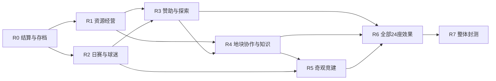

# 黄狗风云开发路线图 · 2026-09-07

> 2026-09-07 用户最新反馈：许多机制尚未决定落地，此方案暂时无法采用。以下保留历史讨论，不作为已批准的开发路线或效果配置。当前已完成 [后台奇观管理](ADMIN_WONDERS_2026-09-07.md)，由用户自行填写效果，可留空暂存。

状态：规划建议，本轮未启动新玩法开发。本文替代 [09-06 路线图](ROADMAP_2026-09-06.md)的开发优先级；旧文档仍保留历史背景。阶段编号用于跟踪交付，不代表已发布版本或承诺日期。

**下一主线：把当前足球征服游戏推进到可持续经营的大地图游戏。** 玩家每天参加一届联赛，以球迷、票房和赞助支持土地开发，再通过不同资源、邻接关系和世界奇观形成发展路线。首个完整经营版的目标包括全部 24 座奇观，不以只完成几座样板结束。

推荐先补结算基础，交付一个小而完整的资源经营循环，再接每日联赛与球迷、赞助和探索、地块协作，最后完成奇观竞建与整批效果。体力、伤病和高级升级调整到后续扩展，不作为这条主线的前置门槛。

## 一、当前实际起点

| 模块 | 当前状态 | 路线图处理 |
| --- | --- | --- |
| 足球与球员 | 地块挑战、比赛引擎、电视台、球员管理、训练、强化、挂牌与汰换已有 | 复用现有流程与快照，补跨系统边界 |
| 球探与设施 | 可移动球探已有；每玩家最多一座中心、LV1 两名；中心拆除已有；升级仍关闭 | 不重做移动球探，不将升级占位当作实际效果 |
| 大地图 | 1,470 地块，欧洲／南美、迷雾与地图表现已有；主地图和地图预览上限已到 30× | 继续增加经营信息和实际奇观，不扩大地图范围 |
| 奇观美术 | 24 座彩色模型、3 档精度共 72 个 GLB、图标与独立图鉴已完成，约 5.07 MiB 文件 | 视为可复用资产，后续补地图放置、LOD 和交互 |
| 奇观玩法 | 24 座效果、选址、竞建和收益上限已有草案 | 还没有世界唯一登记、工程或生效效果 |
| 经济 | 现有运行钱包是金币，初始金币仍为 1,000,000；金币余额和变动要求整数 | 保留测试余额，扩展建材／物资和结算，不直接写入小数金币 |
| 联赛／球迷／赞助 | “每天完成一届联赛”已由用户明确；本项目新系统未实现；S4 有可借鉴的赞助能力 | 迁移功能结构与素材，不迁入 S4 真实账号、合同或余额 |
| 验证与发布 | 最近代码检查 649 次通过；30× 和奇观图鉴有隔离浏览器证据 | 属于本地验证；当前公网实际版本与运行情况未在本轮检查 |

依据：[30× 地图](MAP_ZOOM30_2026-09-07.md)、[彩色奇观](WONDER_COLORS_2026-09-07.md)、[设施状态](../shared/config/buildings.mjs)、[经济服务](../server/application/economy-service.mjs)、[奇观资产清单](../assets/wonders/catalog.json)。

## 二、阶段总览

| 阶段 | 主要交付 | 必要前置 | 完成标志 |
| --- | --- | --- | --- |
| R0 结算与存档基础 | 统一多资源结算、自然日和联赛日标识、持久化去重与迁移规则。 | 当前本地基线 | 断线、重试、重启、保存失败均不重复发奖、不丢扣款；旧余额和卡片保持。 |
| R1 多资源与土地经营 | 建材、物资、固定资源分布、生产仓储、经营席位、开发与基础消耗。 | R0 | 单地主场可启动；三地完成产出—消耗—扩建闭环；离线和换主结算一致。 |
| R2 每日联赛、球迷与主场 | 每日一届自动赛事、主客场、球迷来源地、容量、需求与门票。 | R0 | 8／10／12队样本完整结算；同一天重启不重复发奖；日赛不重置世界。 |
| R3 赞助、社区活动与探索奖励 | S4赞助能力适配、三类广告位、报价箱、分期履约、球迷和合同探索奖励。 | R1、R2 | 完成一份7日合同；报价满箱与重复探索不丢奖励、不重复付款；活动消耗与增长闭合。 |
| R4 稀缺地块、经营协作与知识 | 可靠地形标签、稀有服务、邻接支援、位置调研、专项训练、可完成研究课题。 | R1、R3 | 同样经营席位能形成不同路线；支援不递归；知识确有消费和成果。 |
| R5 奇观竞建与地图接入 | 唯一登记、阶段工程、竞建退款、换主接管与实际GLB地图显示，内部试跑W15。 | R1、R2、R4 | 多人竞建同刻与离线完工正确；夺地不复制资产；30×多奇观显示与交互通过。 |
| R6 全部24座奇观效果 | 四个效果包覆盖24座，统一配额、收益上限、事件快照与界面。 | R3、R4、R5 | 24座全部有选址—建设—运行—停用—换主完整链路；组合数值与原子结算通过。 |
| R7 经营版整体封测与发布验收 | 7／30日总经济、晚加入体验、联赛压测、长时间运行、隔离恢复与更新回退。 | R6 | 无阻塞性存档或结算问题；所有正式开放奇观均完整可用；形成可审阅发布候选。 |

技术依赖与推荐顺序分开：R1 和 R2 都依赖 R0，彼此没有硬依赖，具备开发资源时可以分别推进。单线工作默认先把 R1 的最小闭环做完，再推进 R2；R5 的模型地图适配可提前验证，但竞建开放必须等待经济和争夺规则通过。

## 三、R0：先让新系统共用可靠的结算基础

**玩家可见结果：** 现有操作继续可用，新系统能清楚显示到账、消耗和失败原因。

1. 建立明确的数据契约：worldId、自然日、有效联赛日、业务事件 ID、规则版本、资源余额与余数。世界、每日联赛和普通任务不能共用一个含糊的“赛季重置”。
2. 在已有金币服务旁扩展建材、物资的变动接口，支持一次业务同时扣多种资源、发奖励和变更任务状态。球迷与研究分别建模，不当作可以买卖、直接扣除的库存。
3. 处理金币精度：当前 account.gold 必须是安全整数。建议新经济内部按百分之一金币精度计算，未满一金币部分放入持久化余数账本，累计满额后才记入整数余额。不能把票房算例中的小数直接写进现有余额。
4. 建立永久结算凭据，与最多保留 200 条的金币展示历史分开。裁剪 UI 历史不能让已领取的活动、赞助或比赛重新发奖。
5. 基于现有临时文件、fsync 与 rename 保存，补足业务事务和保存失败回滚；原子替换存档文件不自动等于多项业务操作原子。
6. 迁移采用新增字段、版本和幂等标识，在隔离旧档样本验证。现有金币、球员、地块、市场、球探任务不能因添加资源而重置。
7. 用可控测试时钟核对分段产出、跨日、到期和重启恢复。测试时间不能进入真实账号运行环境。
8. 汇总现有金币／球员投放与回收，建立新手、普通、重度玩家的 7／30 日测算入口。100 万测试资金和正式新手预算分别建样本。

**验收：** 同一请求重复提交、任务到期后重启、保存失败重试、部分资源不足都不能重复扣发或留下半完成状态；小数收益长时间累计守恒；旧档二次迁移不再发启动奖励。

## 四、R1：多资源与土地经营先形成闭环

**玩家可见结果：** 能看见建材和物资，开发地块、选择产出、消耗材料，再投资下一块地。

- 实现建材、物资的余额、仓储、产速与满仓状态，金币继续走原账户。
- 为全图生成并持久化固定资源版本、禀赋和品质种子；同时记录后续可用的特色，避免 R4 开放时整图重抽。首轮先运行金币／建材／物资模式，科研、青训和文化地可使用通用开发，特色服务随依赖开放。
- 开发、模式切换、运行／停用、经营席位及离线分段结算一并完成。候选 3→6 席位按规则单配置，不和建筑槽位混为一谈。
- 给单地主场提供可启动的通用经营和一次性材料包，新增限额采购／基础委托作为补给路径。原有普通训练、球探不因新材料短缺被关停。
- 同批提供能花材料的真实入口：新增地块开发、模式改造、基础物资型活动；新增可选调研或专项训练先使用明确的基线版本，R4 再增强选址和专业化。
- 主场和已有领地保持位置与所有权。资源分布不能偷偷覆盖已经建造的设施，稀有地不按“核心国家”统一加权。
- 失去生产地先结算旧主人时段，新主人取得开发状态但需安排自己的经营席位；在途项目的扣费和归属按冻结的规则处理。

**验收：** 单地可以启动；三地能完成“生产 → 消耗 → 开发”的完整循环；同样运行时间下在线和离线产出相同；满仓、切换、停用、换主和重启不补发不存在的产量。基础资源来源和去向必须一起交付，不能只加三个数字。

## 五、R2：每日一届联赛、球迷和主场票房

**玩家可见结果：** 每天有完整赛程和结果，自己的主场有真实需求与门票收入，球迷积累有来源地区。

- 先完成每日赛事生命周期：报名／分组、赛程、开赛推进、结果、排名、日结算、下一日；状态可恢复，比赛计算复用现有引擎。
- 建议首版使用组内双循环。10 队样本是每队 18 场、9 主场，全组共 90 场；同时验证 8／12 队。具体分组人数、开球窗口、报名截止和人数不足规则在本阶段开工契约中固定，不把样例人数写成用户已确认。
- 明确阵容和主场快照，以及训练、挂牌、离队、地块挑战与日赛之间的关系。继续使用已有球员实例，不新增第三套拥有独立球员所有权的编队。
- 建立球迷总量和来源地分布，接入一次建队基数、当日参赛／成绩增长；球迷不作为可直接消费的货币。
- 开球时锁定主场、容量、需求和票价。只有正常官方主场比赛结算票房；友谊、可重复挑战和无实际比赛的弃权不发同类收入。
- 增加日赛页、主客场标记、赛程、排名、战报和收入明细；复用电视台与通知，减少主地图常驻信息。
- 在当前挑战调度器基础上增加受控比赛队列、公平推进和负载指标。不能为每场比赛各开一个无限定时任务；压测决定可同时承担的组数。

**验收：** 完整日赛可自动结束，离线玩家正常参赛；重启同一日不重排出双份赛程、不重复发奖；主客场数量公平。增加座位但没有需求时不会增收，增加远地球迷不会全部变成本地观众；跨日不会重置世界、球迷或领地。

## 六、R3：赞助、社区活动和中立探索奖励

**玩家可见结果：** 探索新地块能获得当地支持者、资源或合同；俱乐部通过真实履约获得持续赞助。

- 从 S4 拆出品牌目录、三类赞助、广告位、报价接受／拒绝、合同到期与冠名显示的可复用部分，适配本项目的账号、货币与日赛。
- 实现普通 3／球场冠名 1／球队冠名 1 的候选广告结构、最多 5 份待处理报价、品牌排他和报价满箱处理。
- 合同按有效联赛日推进，付款分签约、每日履约和目标奖励；混合材料报酬必须从同一个合同总预算折算。
- 社区活动消费金币和物资，按完成事件增加指定地区球迷，并保留全账号项目队列与次数限制。
- 中立首次探索记录固定候选：球迷、建材、物资、赞助报价等二选一；禀赋影响权重，重复征服不重复抽取。
- 报价入箱不等于签约，签约不等于一次领取整期全部收入。满箱可以先处理，不能覆盖已有报价或吞掉探索奖励。
- 日赛常规报价按一天一次判定起步；不照搬 S4 每场 35% 的报价概率。

**验收：** 在测试时钟中完成一份 7 日合同，从报价到期满的现金／实物守恒；全服停赛顺延、同日重启不双扣期；新探索、冠名和社区活动的重复请求都能恢复。已有 S4 用户合同不出现在本项目新账号里。

## 七、R4：让土地的稀缺性和布局真正生效

**玩家可见结果：** 同样三个经营席位，工业、商业、文化、培养路线能带来不同结果。

- 完成沿海、河流、丘陵、山地、森林等可靠玩法标签，服务资源和奇观选址。视觉树木、屏幕坐标与面积大小不直接决定产量或资格。
- 开放品质差异和首批稀有服务，保留普通地的替代路径。检查普通连通区域与孤岛的基础资源可达性，避免少数起点同时获得所有高价值条件。
- 实现最多两个支援来源、每来源服务一个核心、来源必须运行的邻接规则；跨海移动本身不产生邻接收益。
- 完成位置线／具体位置调研与专项训练。球探使用当前所在地区；先锁原评级和国家分组，再筛位置，训练仍遵守总成长和属性上限。
- 让专业知识拥有真实生产、投入、课题、完成成果与停止切换规则。首批至少三个可完成课题，覆盖培养、建设、社区方向；费用与成果需进入本阶段规则单。
- 接入社区活动的地块差异、普通设施的合法协作类型。已有设施升级继续按当前规则关闭；奇观的 LV1 前置不等待全设施升级系统。

**验收：** 同席位数的路线收益有可解释差异，普通地可以凭位置和投入有价值；没有 A 支援 B、B 支援 A 的递归产出；支援丢失正确切段；不可见区域不泄露稀有服务和敌方经营状态；知识不是没有用途的数字。

## 八、R5：奇观竞建和实际地图接入

**玩家可见结果：** 可以在合法地块规划、分期建设、争夺一座真正独占的奇观；模型在大地图中可见、可选、可管理。

- 实现 worldId 下的唯一目录、合法选址、运行配额和工程队列。每日联赛重置不清空奇观。
- 完成阶段投入、工程托管、材料不足暂停、同刻完工裁决、被抢先／取消／丢地返还及满仓退款接收。
- 在同一业务事务内完成世界唯一登记、地块建筑状态、资金与工程终态；服务器恢复时按有效完工时刻重放。
- 接入已有领地挑战的所有权事件，并补齐多人争夺同一地块、结算时目标已换主、永久主场保护和冷却的一致性。基础争夺公平不能拖到奇观上线之后。
- 建成后换主保留奇观实体，新的经营者满足接管条件后获得未来效果。玩家已有球迷、合同、研究和球员不跟建筑转移。
- 把现有 GLB 放入正式 Three 地图：统一底座高度、占地比例、归属与建造状态、迷雾可见性、点击和管理面板；共享渲染器、加载器与环境，不为每座模型建立一个 WebGL 画布。
- 按屏幕占用选择三档 LOD，远景使用图标；测试 30×、多建筑同屏、隐藏／显示和反复换主后的资源释放。现有单体图鉴验证不能替代大地图性能验收。
- 内部首条完整流程选择 **W15 比萨斜塔**：建材产出、开发折扣和常规前置较易观察，适合覆盖付费、完工、运行和退款。这个内部样板不改变首批正式内容为 24 座的目标。

**验收：** 多人、离线更早完工、相同时刻、缺料、抢先、掉线、存档失败、地块被夺均有唯一可追溯结果；不能复制奇观、退款或阶段进度；模型与服务端状态一致。

## 九、R6：四个效果包接齐全部 24 座

所有效果继续以 [24 座效果草案](WONDER_EFFECTS_2026-09-07.md)为候选基线；涉及数值调整时同步规则版本与算例，不在界面和服务端分别写一套常量。

| 批次 | 建筑 | 重点验收 |
| --- | --- | --- |
| R6-A 资源与布局 · 9 座 | W05 勃兰登堡门、W09 阿尔罕布拉宫、W11 贝伦塔、W12 新天鹅堡、W14 加尔桥、W15 比萨斜塔、W18 马丘比丘、W19 拉莫内达宫、W22 拉斯拉哈斯圣殿 | 产出与折扣、容量撤销、景观和跨河／跨海支援；W15 为样板复验 |
| R6-B 球迷与文化 · 5 座 | W01 埃菲尔铁塔、W02 罗马斗兽场、W03 圣家堂、W07 卢浮宫、W17 里约基督像 | 来源地分配、连续运营、活动替代和每日额外球迷上限 |
| R6-C 联赛与赞助 · 5 座 | W06 凡尔赛宫、W16 伯纳乌球场、W20 科隆剧院、W21 萨尔沃宫、W24 马拉卡纳球场 | 需求与经营收入分开、日赛快照、票房共同上限、合同分期与附加奖励 |
| R6-D 培养与科研 · 5 座 | W04 大本钟／伊丽莎白塔、W08 大英博物馆、W10 雅典卫城、W13 原子球塔、W23 明日博物馆 | 耗时与次数、位置筛选、知识消费、先折扣后返还及原有成长边界 |

R6-C 依赖 R2/R3，R6-D 依赖 R4 的真实研究与调研；不能先写一条说明假装功能已经存在。四包的开发顺序可以调整，但进入 R7 前必须覆盖 24 个唯一资产 ID，不能遗漏或重复计算样板。

每座完成标准统一为：选址预览 → 可支付阶段工程 → 完工模型 → 实际基础产出和特色效果 → 配额/停用 → 换主恢复 → 后台可追溯。拥有名字、图标或配置条目不计作完成。

## 十、R7：整体封测，再形成发布候选

**玩家可见结果：** 一整轮“日赛 → 收入和球迷 → 土地发展 → 赞助 → 奇观”的过程可以长期持续。

- 做 7／30 日全经济模拟，将门票、赞助、征服、卡片回收、市场费用、资源生产、活动与奇观投入放在同一张表中。此前局部算例不能当作全经济已平衡。
- 对比单地、三地、六席位、大量领土但席位有限、晚加入及每 6／24／48 小时操作的玩家；观察断供、满仓、首个特色项目、奇观竞争资格和长期收入集中。
- 使用足够的隔离账号完成至少 7 个有效联赛日的功能覆盖，并安排连续 72 小时的实际进程运行。加速时钟验算和真实运行分别记录。
- 记录目标分组量下的比赛完成时长、API 响应、事件循环、保存耗时、内存及地图帧率，以实测决定扩大规模。若出现瓶颈，再隔离比赛计算或迁移存储，不直接让多进程同时写一份 JSON。
- 检查回档恢复、重复事件、旧档迁移、活动关闭、规则版本变化及更新失败回退。备份恢复必须在隔离目录演练。
- 做一轮完整新手体验和关键页面小屏检查；验证“不拥有奇观仍可正常成长”，并确认后加入玩家有合法获得奇观的竞争路径。
- 汇总实际已验收代码、资源、迁移说明、操作记录和发布清单。打包、部署和公网验收按届时用户指令执行，本路线图不代表已发布。

## 十一、后续扩展的顺序

这些内容保留为项目后续工作，不挤占经营版关键依赖：

1. **长期体力与伤病 → 恢复／医疗设施。** 先定义持久化状态、自然恢复和市场转移，再开放设施服务；不恢复此前整包回退代码，不加入士气。
2. **有效果的设施升级与专业分支。** 一次交付一类设施的效果、费用、施工和面板，先验证低等级。当前升级仍是占位；旧价格数组不是最终方案。
3. **领袖与新增特性。** 在经济、技能事件和叠加规则稳定后增加差异，比赛效果须经过引擎与战报验证。
4. **资源挂单市场。** 先验证生产和消耗，再做建材／物资托管交易及税费；球迷、知识和土地资格不商品化。
5. **长期分级联赛、地区合作、NPC 目标。** 在每日一届稳定后加入跨日荣誉、分级与阶段目标；不自动重置大地图或删除资产。

HTTPS、备份、监控、发布回退和阻塞性缺陷处理贯穿所有阶段，不等待这些扩展完成。公网现况在需要发布时重新核验。

## 十二、下一轮建议直接领取的工作包

**建议任务名：多资源账本与单地经营闭环。** 范围是 R0 最小基础 + R1 最小可玩部分；下面都是待实施任务，本次只完成路线图。

| 顺序 | 任务 | 可检查的产物 |
| --- | --- | --- |
| 1 | 固定资源、时间、精度和事件契约 | 数据字段表、日边界、金币余数及结算样例 |
| 2 | 在隔离旧档样本上添加新字段与迁移 | 重复迁移无额外奖励、余额/任务不变的结果 |
| 3 | 接多资源变动与业务去重 | 资源不足、重复请求、保存失败的闭合行为 |
| 4 | 做一块地的开发、产出、停用与模式切换 | 使用真实服务端状态的地块操作，不先做静态计数器 |
| 5 | 接仓储、一次启动资源与一个消费入口 | 能自产、自用，再开发下一块地 |
| 6 | 做资源栏和地块经营面板 | 少量必要信息：余额、产速、容量、席位、当前任务 |
| 7 | 完成单地和三地场景验收 | 在线／离线、满仓、切换、换主与重启一致 |
| 8 | 更新交接与阶段状态 | 本地完成、浏览器验收与未开放部分清晰可查 |

初始参数优先沿用资源与奇观草案作为测试基线，明确标为候选；例如经营 3→6 席位、最多运行3座奇观、工程 A/B/C 与球迷上限都不是“用户已经批准上线”的事实。只有参数变化或新的重大范围选择才需要重新整理决策，不因完成一个文件就反复停下来确认。

## 十三、如何维护进度

阶段状态建议分为：待开发、实现中、功能可用、验收通过、已发布。模型资产完成和奇观玩法完成分别记录；代码验证、隔离浏览器、真实账号与公网验证分别记录。

不以文件数量、测试总数或已经花费的时间作为完成度百分比。每次接续只推进当前工作包，并维护本地待发布差异。

当前缺少团队产能和实测工期，因此先按依赖与验收安排，不编造固定周数。R0/R1 小闭环完成后，再用实际任务耗时制定后续日历；需要先看到每日比赛时，R2 可在 R0 之后独立排入。

相关基线：[资源与地块](RESOURCE_TERRITORY_PLAN_2026-09-07.md)、[联赛／球迷／赞助](FANS_WONDERS_SPONSORS_PLAN_2026-09-07.md)、[24 座奇观效果](WONDER_EFFECTS_2026-09-07.md)、[多路线旧提案](DEVELOPMENT_PATHS_2026-09-06.md)。机器可读的阶段与依赖见 [roadmap.json](../outputs/roadmap-20260907/roadmap.json)。

本轮仅编写路线图和同步交接入口；未新增玩法代码，未重跑游戏测试，未操作真实存档、服务或发布环境。

